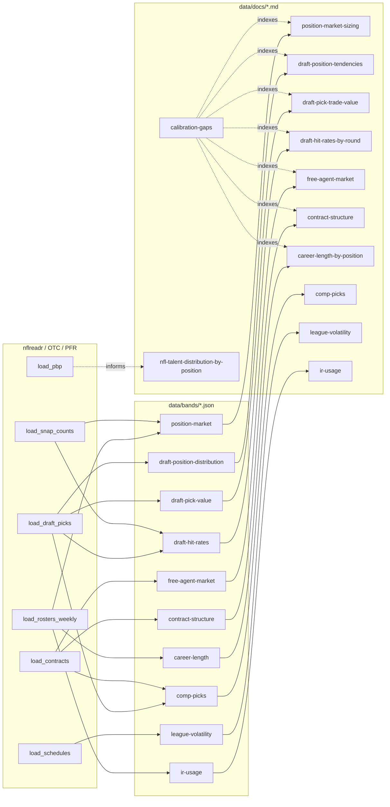

# `data/docs/` — NFL calibration references

Narrative companions to the machine-readable bands in
[`data/bands/`](../bands/). Each doc explains **what the NFL actually does** for
a slice of league behavior — volumes, tiers, curves, market shapes — so the Zone
Blitz sim can be calibrated against it.

The JSON in `data/bands/` is what the sim's calibration harness asserts against.
The Markdown here is what a human (or a coding agent) reads to understand _why_
those numbers look the way they do, and which narrative priors belong in the AI
layer when the feed can't answer.

## How the docs fit together

## Index

### Meta-game (market & career)

| Doc                                                            | What it covers                                                                                                      | Feeds                                                           |
| -------------------------------------------------------------- | ------------------------------------------------------------------------------------------------------------------- | --------------------------------------------------------------- |
| [calibration-gaps.md](./calibration-gaps.md)                   | Master index of what's done vs what's missing across play-level, game-level, and season/career realism.             | The roadmap.                                                    |
| [position-market-sizing.md](./position-market-sizing.md)       | 53-man roster slots by position, meaningful contributors, clear starters. QB is 2, OL is 8, specialists are 1-deep. | Player generator, league init, depth-chart classification.      |
| [draft-position-tendencies.md](./draft-position-tendencies.md) | Which positions go in which rounds. QB/WR/EDGE/OT/CB are ~65% of top-10; RB/LB double their R1 counts by R7.        | Draft class generator, NPC GM positional-value prior.           |
| [draft-pick-trade-value.md](./draft-pick-trade-value.md)       | Jimmy Johnson vs Rich Hill vs Chase Stuart — three canonical trade-value charts and when they disagree.             | AI GM trade evaluator, user trade grade.                        |
| [draft-hit-rates-by-round.md](./draft-hit-rates-by-round.md)   | P(multi-year starter \| round, position). 86% for R1, 7% for R7. Round 4 is the cliff.                              | Prospect generation, post-draft grade UI.                       |
| [free-agent-market.md](./free-agent-market.md)                 | UFA volume, AAV tiers, signing waves, own-team re-sign rates by position.                                           | FA period generator, NPC bid AI.                                |
| [contract-structure.md](./contract-structure.md)               | Contract shape — length, guarantee %, signing-bonus share, year-by-year cap hit, void years, restructures.          | Contract offer generator, cap AI, cut/restructure decisions.    |
| [career-length-by-position.md](./career-length-by-position.md) | Five canonical aging shapes — specialist longevity, QB tail, OL plateau, mid-career cohort, RB/CB cliff.            | Aging system, retirement decisions, franchise-planning windows. |
| [comp-picks.md](./comp-picks.md)                               | Compensatory picks — 32/yr cap, P(comp \| net UFA losses), round mix, minority-hire supplemental picks.             | AI GM "let him walk for the comp pick" decision, draft supply.  |
| [ir-usage.md](./ir-usage.md)                                   | IR placements per team-season, ~30% return rate, ~5-week absence, position concentration (CB/OL/LB lead).           | In-season roster-slot pressure, waiver AI, PS elevations.       |

### Front-office market (coaches + scouts)

| Doc                                  | What it covers                                                                                                                          | Feeds                                                                  |
| ------------------------------------ | --------------------------------------------------------------------------------------------------------------------------------------- | ---------------------------------------------------------------------- |
| [coach-market.md](./coach-market.md) | HC / OC / DC / STC / position-coach salary + contract length + buyout conventions; HC age (mid-30s first-timer mode) and coaching tree. | Coach generator, hiring-carousel AI, HC / coordinator contract offers. |
| [scout-market.md](./scout-market.md) | Director / cross-checker / area-scout salary + contract length + buyout; staffing levels, prospect workload, position-focus by tier.    | Scout generator, scouting-assignment AI, `workCapacity` calibration.   |

These two docs carry **qualitative priors** rather than feed-derived statistics
— coach and scout contracts are not in nflreadr. Numbers are synthesized from
OverTheCap, The Athletic, PFF, PFN, team sites, and beat reporting, and should
be read as the shape public reporting describes rather than asserted values.

### League-level volatility

| Doc                                            | What it covers                                                                                                                                        | Feeds                                                           |
| ---------------------------------------------- | ----------------------------------------------------------------------------------------------------------------------------------------------------- | --------------------------------------------------------------- |
| [league-volatility.md](./league-volatility.md) | YoY win correlation (~0.35), playoff persistence (~53 %), division churn (~13 % worst→first), and per-seed playoff advancement (1-seed wins SB 15 %). | Season-sim sanity checks, playoff bracket calibration, UI odds. |

### Player-rating calibration

| Doc                                                                                | What it covers                                                                                                               | Feeds                                   |
| ---------------------------------------------------------------------------------- | ---------------------------------------------------------------------------------------------------------------------------- | --------------------------------------- |
| [nfl-talent-distribution-by-position.md](./nfl-talent-distribution-by-position.md) | Tier splits (Replacement / Weak / Average / Strong / Elite) per position. QB is bimodal; OL compresses; EDGE rides the tail. | Player-generation rating distributions. |

## Conventions used across these docs

- **Rating midpoint = 50** on the Zone Blitz 0–100 scale. Average is ~50, not
  ~60. Elite rides the tail.
- **Tier naming** — `top_10 / top_25 / top_50 / rest` for market bands
  (APY-ranked within a position group).
  `Replacement / Weak / Average / Strong
  / Elite` for rating tiers.
- **Position canonicalization** — OL collapses T/G/C in roster feeds; CB_DB
  includes generic `DB`; LB includes OLB / ILB / MLB. Finer splits live in the
  draft and snap-count data.
- **Season windows** — market and contract bands use 2020–2024 (post-COVID-cap
  era). Draft hit-rates use 2013–2020 (`snap_counts` coverage starts 2013, 2020
  is the latest with a full 5-year runway). Career-length uses 2005–2024 (20
  years for aging curves).

## Adding a new doc

1. Generate or extend a band under `data/R/bands/` and write JSON to
   `data/bands/`.
2. Write the narrative here in `data/docs/`. Lead with what the NFL does and the
   sim implications, not the R plumbing.
3. Add a row to [calibration-gaps.md](./calibration-gaps.md) linking the band
   and doc.
4. Add a row to the index tables above so the next reader finds it.

Use the [`nflfastr`](../../CLAUDE.md) skill for nflverse-reachable data and the
[`bigdatabowl`](../../CLAUDE.md) skill for player-tracking-specific questions.
