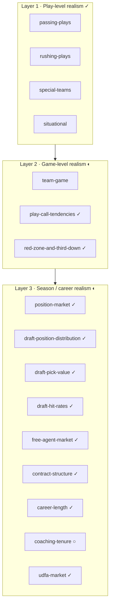
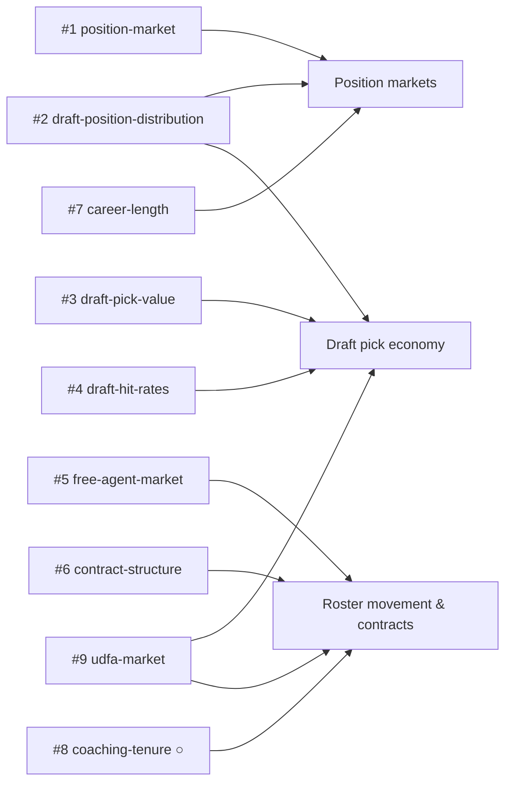

# Calibration Gaps — League-Building Data Index

An index of the **real-NFL data insights** the Zone Blitz sim still needs in
order to feel like a credible league, not just a credible game of football. Each
entry points at a planned band artifact (`data/bands/*.json`) or a research doc
(`data/docs/*.md`), and the open GitHub issue tracking the work.

The existing [`data/README.md`](../README.md#bands-currently-produced) covers
the **in-game** calibration (play-by-play realism). This index covers the
**meta-game**: how players enter the league, how they're paid, how they move
between teams, how careers end, and how coaching staffs churn. These are the
inputs that decide whether a league feels _alive between games_.

## Organizing principle

The sim has three layers of calibration targets:

1. **Play-level realism** — one snap at a time. Mostly done (`passing-plays`,
   `rushing-plays`, `special-teams`, `situational`).
2. **Game-level realism** — drive and game flow, personnel usage, game script.
   Partially done (`team-game`). Gaps listed below in the **Game Flow** group.
3. **Season / career realism** — who's on rosters, who gets paid, who gets
   drafted, who retires, who gets fired. Entirely missing. Gaps listed below in
   the **Market & Career** group.

Legend: ✓ landed · ◐ in progress · ○ not started.

## Market & Career (the league-building layer)

| # | Gap                                                                                                                                                                                                           | Primary source                                          | Issue       |
| - | ------------------------------------------------------------------------------------------------------------------------------------------------------------------------------------------------------------- | ------------------------------------------------------- | ----------- |
| 1 | Position market sizing (roster slots, starter counts, snap-share thresholds per position) — [band](../bands/position-market.json) + [doc](./position-market-sizing.md)                                        | `nflreadr::load_rosters_weekly()`, `load_snap_counts()` | #510 (done) |
| 2 | Draft position distribution (positions picked per round, last 10 drafts) — [band](../bands/draft-position-distribution.json) + [doc](./draft-position-tendencies.md)                                          | `nflreadr::load_draft_picks()`                          | #511 (done) |
| 3 | Draft pick trade-value (observed vs Jimmy Johnson / Rich Hill curves) — **landed** via [`draft-pick-value.json`](../bands/draft-pick-value.json) + [`draft-pick-trade-value.md`](./draft-pick-trade-value.md) | `load_draft_picks()` + trade scrape                     | #512 (done) |
| 4 | Draft hit-rate bands — `P(multi-year starter \| round, position)` — **landed** via [`draft-hit-rates.json`](../bands/draft-hit-rates.json) + [`draft-hit-rates-by-round.md`](./draft-hit-rates-by-round.md)   | `load_draft_picks()` + career snaps                     | #513 (done) |
| 5 | Free agent market (UFAs signed per offseason by position, AAV bands) — [band](../bands/free-agent-market.json) + [doc](./free-agent-market.md)                                                                | `nflreadr::load_contracts()`                            | #514 (done) |
| 6 | Contract structure (length, guarantee %, cap-hit shape by position × tier) — [band](../bands/contract-structure.json) + [doc](./contract-structure.md)                                                        | `load_contracts()` + OTC cross-check                    | #515 (done) |
| 7 | Career length + aging curves — `P(active \| age, position)`, peak years — [band](../bands/career-length.json) + [doc](./career-length-by-position.md)                                                         | `load_rosters()` longitudinal                           | #516 (done) |
| 8 | Coaching tenure + firing patterns (HC tenure distribution, W-L triggers, coordinator → HC rates)                                                                                                              | Manual scrape (PFR head-coach history)                  | #517        |
| 9 | Compensatory pick allocation (per-team mean/sd, round mix, P(comp \| net UFA losses), 32/yr cap, minority-hire specials) — [band](../bands/comp-picks.json) + [doc](./comp-picks.md)                          | `load_draft_picks()` + `load_contracts()`               | #541 (done) |

These directly serve the user-named asks:

- **Position markets** — #1, #2, #7.
- **Draft pick economy** — #2, #3, #4.
- **Roster movement / contracts** — #5, #6, #8.

## Game Flow (the situational-realism layer)

| #  | Gap                                                                               | Primary source         | Issue | Status                                                                         |
| -- | --------------------------------------------------------------------------------- | ---------------------- | ----- | ------------------------------------------------------------------------------ |
| 9  | Play-call tendencies by situation (pass/run by D&D, score diff, time, field zone) | `nflreadr::load_pbp()` | #518  | Done — [`play-call-tendencies.json`](../bands/play-call-tendencies.json)       |
| 10 | Red-zone + 3rd-down efficiency (play-call mix + conversion rates)                 | `load_pbp()`           | #519  | Done — [`red-zone-and-third-down.json`](../bands/red-zone-and-third-down.json) |

## Season / League (the standings-realism layer)

| #  | Gap                                                                                                                                                                 | Primary source                                          | Issue       |
| -- | ------------------------------------------------------------------------------------------------------------------------------------------------------------------- | ------------------------------------------------------- | ----------- |
| 11 | YoY win correlation + playoff persistence + division churn + per-seed playoff advancement — [band](../bands/league-volatility.json) + [doc](./league-volatility.md) | `nflreadr::load_schedules()` + `load_teams()`           | #535 (done) |
| 12 | UDFA market (signings per team/offseason by position, hit rate vs late-round picks) — [band](../bands/udfa-market.json) + [doc](./udfa-market.md)                   | `load_rosters()` left-anti `load_draft_picks()` + snaps | #536 (done) |

## Sim-engine band extraction (B-series)

Bands extracted for the sim engine (`docs/technical/sim-tasks/INDEX.md`
B1–B11). Status tracking for the MVP blockers and downstream model feeds.

| #   | Band                                                      | Source      | Status                                                     |
| --- | --------------------------------------------------------- | ----------- | ---------------------------------------------------------- |
| B1  | [`penalties.json`](../bands/penalties.json)               | nflfastR    | Done                                                       |
| B2  | [`weather-modifiers.json`](../bands/weather-modifiers.json) | nflfastR  | Done                                                       |
| B3  | [`surface-modifiers.json`](../bands/surface-modifiers.json) | nflfastR  | Done                                                       |
| B4  | [`home-away.json`](../bands/home-away.json)               | nflfastR    | Done                                                       |
| B5  | [`hail-mary.json`](../bands/hail-mary.json)               | nflfastR    | Done                                                       |
| B6  | `overtime.json`                                           | UFL/XFL     | Deferred — needs non-nflfastR (UFL/XFL) sources for rule-variant OT data. |
| B7  | [`fake-kicks.json`](../bands/fake-kicks.json)             | nflfastR    | Done — small n (heuristic on desc); consider FTN enrichment |
| B8  | [`muffed-punts.json`](../bands/muffed-punts.json)         | nflfastR    | Done                                                       |
| B9  | `checkdown-under-pressure.json`                           | bigdatabowl | Pending                                                    |
| B10 | `sub-play-pass-breakdown.json`                            | bigdatabowl | Pending                                                    |
| B11 | per-position penalty rates (`per-position/*.json`)        | nflfastR    | Pending                                                    |

## Future consideration (not yet issue-filed)

Promising but lower-priority, or requiring non-nflfastR sources:

- **Game script / win-probability behavior** — how pass rate shifts with WP and
  score differential. Needed for end-game realism. `load_pbp()` has `wp`.
- **Home field advantage + weather/dome splits** — point spread and scoring
  deltas. Needed for schedule-level realism.
- **Injury return timelines by injury category** — already have injury rates
  (`injuries.json`); the return-timeline distribution is the next slice.
- **Player development curves** — rookie Y1 → Y2 → Y3 stat jumps by position.
  Powers the "breakout season" sim beat.
- **Snap-share rotations** — starter vs committee (RB1/RB2 carry share is
  covered; WR3/TE2/nickel CB rotations are not).
- **Big Data Bowl — coverage shell (man vs zone) usage rates** — needs the
  `bigdatabowl` skill. Feeds NPC defensive-coordinator AI.
- **Big Data Bowl — formation / personnel frequency (11/12/21, shotgun)** —
  feeds offensive play-selection realism.
- **Penalty distributions by position × situation** — extends `team-game`
  penalty mean.

## How to fill a gap

Each filed issue produces one or both of:

- **A band artifact** under `data/bands/*.json` — if the insight is a
  distribution the sim can assert against.
- **A research doc** under `data/docs/*.md` — if the insight is a qualitative
  reference (like
  [`nfl-talent-distribution-by-position.md`](./nfl-talent-distribution-by-position.md)).

Most Market & Career gaps need **both**: a doc to document tiers and narrative,
and a band if the numbers are tight enough to assert.

Use the `nflfastr` skill for nflverse-reachable data and the `bigdatabowl` skill
for player-tracking-specific questions. Every band script follows the pattern in
[`data/R/bands/`](../R/bands/) — `parse_seasons()` + `write_band()` helpers live
in [`data/R/lib.R`](../R/lib.R).
