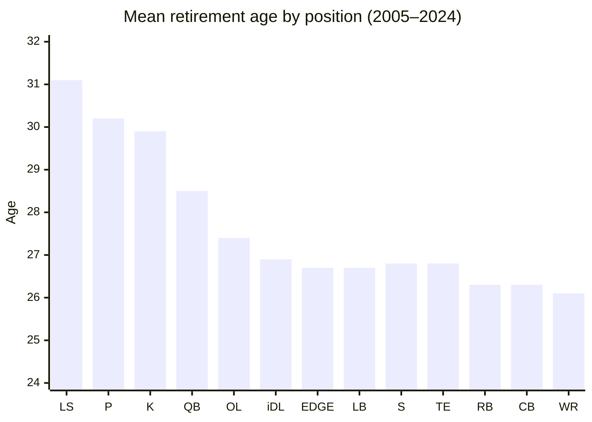
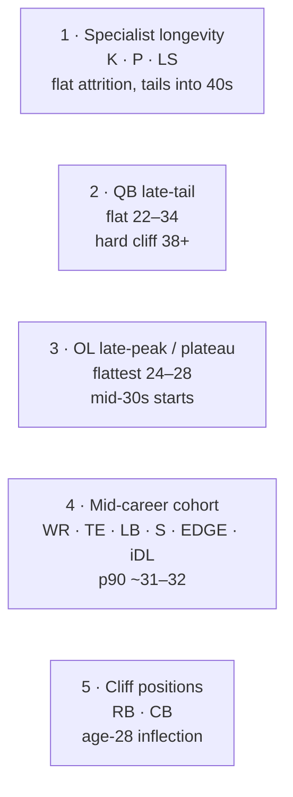
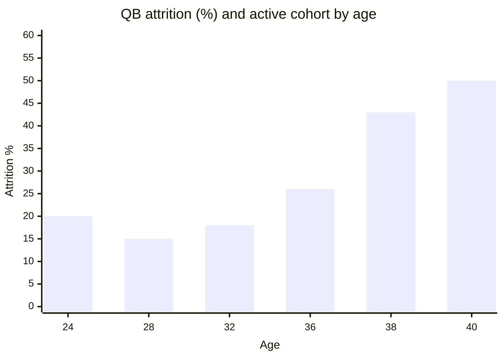
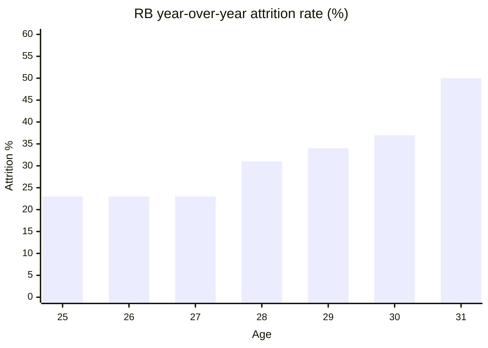

# Career Length + Aging Curves by Position

A practical reference for how NFL careers end, by position. RBs fall off a cliff
at 27–28, WRs age gracefully into 31, OL keep starting into their mid-30s, QBs
play into their 40s, specialists go forever. The Zone Blitz aging system uses
these curves to drive year-over-year attribute decay, retirement decisions, and
franchise planning windows.

Numbers come from [`data/bands/career-length.json`](../bands/career-length.json)
(seasons 2005–2024, 20 years of rosters). See the R script at
[`data/R/bands/career-length.R`](../R/bands/career-length.R).

## Mean retirement age at a glance

Specialists ride the tail; RB / CB / WR are the early-exit positions.

## The five canonical aging shapes

### 1. Specialist longevity (K / P / LS)

Effectively indefinite while the leg holds up.

| Metric              |    K |    P |   LS |
| ------------------- | ---: | ---: | ---: |
| Mean retirement age | 29.9 | 30.2 | 31.1 |
| p90 retirement age  |   38 |   38 |   38 |
| Oldest observed     |   48 |   44 |   43 |

Attrition is flat through the 20s and only inches up after 35. Modal age across
the window is 24–27 because those are the ages with the most players cycling
through, not because careers peak there.

> _"Justin Tucker, Adam Vinatieri, Morten Andersen"_ — specialists have the
> longest tails of any position in the sport.

### 2. Quarterback longevity

Flat decay from 22 through 34, gentle cliff at 35–37, hard cliff at 38+.

| Age | Attrition rate | Active cohort |
| --: | -------------: | ------------: |
|  24 |            20% |           263 |
|  28 |            15% |           145 |
|  32 |            18% |            76 |
|  36 |            26% |            39 |
|  38 |            43% |            23 |
|  40 |            50% |             6 |

Mean retirement age **28.5**, p90 **36**. The tail is the story: Brady, Rodgers,
Brees, Roethlisberger. Most QBs wash out before 30, but the ones who don't stick
around a long time.

> **Sim beat:** the bimodal QB outcome — either out by 28 or starting into your
> late 30s — is an aging-curve feature, not a bug.

### 3. OL late-peak / long plateau

Offensive linemen peak later than any position group and decline slowly.

| Age | Attrition rate | Active cohort |
| --: | -------------: | ------------: |
|  24 |            15% |         1,101 |
|  28 |            16% |           564 |
|  30 |            26% |           395 |
|  32 |            38% |           202 |
|  35 |            55% |            42 |

Mean retirement age **27.4**, p90 **33**. OL careers are wide: a quality guard
or center can start into his mid-30s (Jason Kelce, Joe Thomas, Alejandro
Villanueva). The ~15% attrition plateau from 24–28 is the flattest any
skill-group shows.

### 4. WR / TE / LB / S / EDGE / iDL — the mid-career cohort

Mean retirement 26–27 across these positions. Attrition rises steadily from ~20%
in the early 20s to ~30% by the late 20s.

- **WR** mean retirement 26.1, p90 31. Tail is longer than the mean suggests —
  ageless outliers (Larry Fitzgerald, Julio Jones) exist.
- **iDL** mean 26.9, p90 32. Big-body DTs tend to hold up once they're
  established.
- **EDGE** mean 26.7, p90 32. Elite pass rushers persist (T.J. Watt, Cam
  Jordan); rotational EDGE wash out by 27.
- **LB** mean 26.7, p90 31. Scheme-dependent; coverage LBs age worse.
- **S** mean 26.8, p90 31. Safety has commoditized — churn is high.
- **TE** mean 26.8, p90 32. Blocking TEs persist longer than receiving TEs in a
  way the mean hides.

### 5. RB / CB — the cliff positions

The two positions where the "cliff" is real, visible, and sharp.

**Running back:**

| Age | Attrition rate |
| --: | -------------: |
|  25 |            23% |
|  27 |            23% |
|  28 |        **31%** |
|  29 |            34% |
|  30 |            37% |
|  31 |        **50%** |

Mean retirement **26.3**, p90 **31**. The age-28 jump is the analytics cliché
made literal. By 31, half of still-active RBs are gone the next year. Christian
McCaffrey's age-28 season getting a $19M/yr deal is against the grain.

**Cornerback (generic `CB_DB`):**

Mean retirement **26.3**, p90 **31**. Similar shape to RB but with a slightly
later cliff. Elite corners (Revis, Sherman tier) persist; middle-tier CBs churn
faster than any defensive position.

## Aging-curve design implications

1. **Position-conditioned decay.** A single global aging curve will ruin the
   sim. Each position gets its own decay vector; the biggest splits are K/P/LS
   vs RB/CB.
2. **Age-28 is the inflection for skill positions.** RB, WR, CB, S — all show
   year-over-year attrition jumping from the low-20s to the mid-to-high 20s of
   percentage at age 28.
3. **QB and OL decay is gentler but not zero.** Both positions show ~15–18%
   attrition through age 30 — a real, persistent background rate of retirement,
   injury, or benching that has to be modeled.
4. **The p90 retirement ages are the "franchise anchor" age.** When drafting a
   rookie, the realistic ceiling for career length is the p90: a QB drafted at
   22 could reasonably play through 36; an RB drafted at 22 is almost certainly
   done by 31.
5. **Modal (peak) age ~24 is a cohort artifact.** It reflects the volume of
   rookie / sophomore / junior player-seasons — not actual skill peak. The sim's
   attribute-peak curves should differ from this: RBs peak earlier (24–26), WRs
   and CBs peak around 25–27, QBs peak 26–30, OL peak 27–30.

## Cross-reference with external aging-curve work

- **Football Outsiders / FTN aging studies** — RB age-28 cliff is the single
  most-replicated finding in the literature.
- **PFF grading decay curves** — WR grades plateau from 25 through 31; OT grades
  plateau from 26 through 32.
- **Pro Football Reference AV-by-age tables** — align with this data's modal
  ages (cohort-volume peaks) rather than skill peaks. Use them for
  cross-checking but prefer in-house skill-peak modeling.

## Sources & caveats

- `nflreadr::load_rosters(2005:2024)` — 20 years of seasonal rosters.
- Age computed as `floor((season_start_Sep1 - birth_date) / 365.25)`.
- Position canonicalization is coarser than the market band: OL collapses all
  T/G/C tags; CB_DB includes generic `DB`; LB includes OLB / ILB / MLB. The
  cliff-vs-plateau narrative holds up under either canonicalization.
- `p_active_by_age` uses an age-22 cohort denominator. Players who first entered
  the NFL older than 22 (specialists, late-bloomer OL) are excluded from that
  metric — use the attrition and retirement-age tables for those positions
  instead.
- `retirement_age` only counts players whose last observed season is at least
  two years before the end of the window, to avoid treating still-active players
  as retired.
- This is a working reference, not an academic study. External PFF/FO/FTN
  aging-curve papers remain the best source for fine-grained attribute-decay
  shapes within a career; this band is the "who is on the roster at all" prior.
