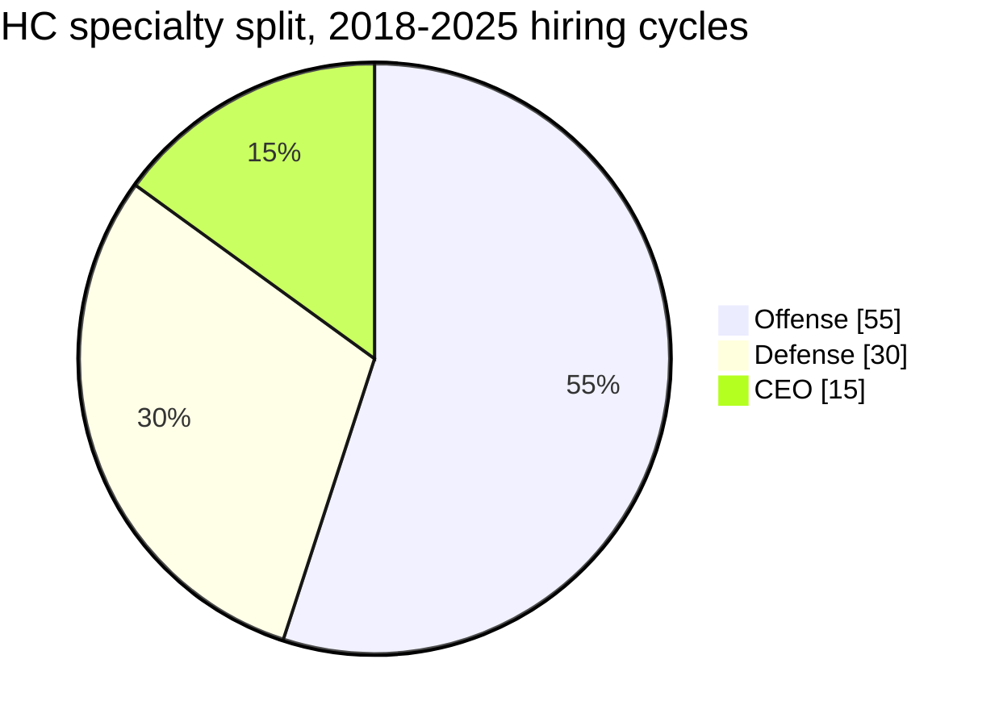

# NFL Coach Market — Salary, Contract Length, Age, and Coaching Tree

A calibration reference for the Zone Blitz sim's **coach generator**
(`server/features/coaches/coaches-generator.ts`) and the downstream **hiring
carousel AI**. Unlike the player-side bands, coach contracts are not published
in any machine-readable feed — the numbers here are **qualitative priors** drawn
from public reporting and marked as such per the acceptance criteria of
[issue #537](https://github.com/Tiernebre/zone-blitz/issues/537).

Companion band: [`data/bands/coach-market.json`](../bands/coach-market.json).
Cross-reference for tenure / firing patterns:
[`data/docs/coaching-tenure-and-firings.md`](./coaching-tenure-and-firings.md) —
tracked under [#517](https://github.com/Tiernebre/zone-blitz/issues/517). This
doc deliberately does not duplicate that content.

## Sources

Every number in this doc and the companion band is a **prior**, not a
feed-derived statistic. Major sources pattern-matched across:

- **OverTheCap** — partial coach-salary tracker for deals that leak into the
  press; primarily HC and top OC tier.
  - <https://overthecap.com/coach-contracts/>
- **The Athletic** — annual coach-contract roundups (Dianna Russini, Jeff Howe)
  publish HC and top-coordinator AAV estimates each hiring cycle.
- **Pro Football Focus** — 2024 HC + coordinator salary ranking piece.
- **ESPN front-office tenure records** — HC age, start year, end year across
  every hiring cycle back to 2000.
- **Team-site press releases** — contract length is almost always in the hiring
  press release; dollar figures rarely are.
- **Pro Football Network / beat reporting** (Aaron Wilson, Tom Pelissero, Jeremy
  Fowler) — fill in the coordinator and position-coach bands that OTC doesn't
  track.

When a number appears without a specific attribution, treat it as the **rounded
median** of the reported range across these sources for a 2018-2025 hiring
window.

## Source confidence tier

- **HC salary + contract length** — public for ~60% of hires; the prior is
  well-anchored.
- **HC age + coaching tree** — fully public; high confidence.
- **OC / DC salary** — public for ~30% of hires (the top half of the market);
  prior is directionally correct, tail is inferred.
- **STC + position-coach salary** — rarely public; prior is a pattern-match from
  reporting on a handful of named contracts.
- **Buyout conventions** — rarely quantified publicly; inferred from post-firing
  settlement reporting.

## Tiers used in the generator

The coach generator already tiers roles as **HC / COORDINATOR / POSITION** with
a per-role override for OC/DC/STC/OL/QB/ST_ASSISTANT salary. The bands below
reuse that shape.

## Head coach — the market has reshaped post-McVay

### Salary

- **Ceiling (approx $20M/yr)** — Belichick's final NE years, Reid's 2024
  extension, Harbaugh LAC (5y/approx $80M), Payton DEN (5y/approx $90M+).
- **p90 (~$14M/yr)** — Ben Johnson CHI 2025 (reported ~$13M), second-cycle
  retread hires, top-end first-time HCs with maximum leverage.
- **p50 (~$8.5M/yr)** — the median HC. First-time hires coming out of
  offensive-coordinator jobs on winning staffs (Macdonald SEA ~$8M, DeMeco Ryans
  HOU ~$7M).
- **p10 (~$5.5M/yr)** — low-leverage hires, interim conversions, HCs hired by
  cap-constrained owners.
- **Mean (~$9M/yr)** — The Athletic and PFF 2024 roundups converge here.

The current generator's HC band (`$6M–$14M` uniform, `coaches-generator.ts:163`)
is directionally fine for the p10–p90 range but **misses the ceiling** and
doesn't concentrate mass at the median. Sample from a triangular distribution
around $8.5M with a stretched right tail to $20M.

### Contract length — 5 years is modal, not uniform 3-5

This is the single biggest correction the issue asks for. The current generator
rolls `intInRange(3, 5)` which flattens the mode. Real HC contracts concentrate
at **5 years** as the default:

| Length   | Share of 2018-2025 HC hires (approximate) | Examples                                                                                    |
| -------- | ----------------------------------------- | ------------------------------------------------------------------------------------------- |
| 4 years  | ~20%                                      | Retread / lower-leverage hires                                                              |
| 5 years  | ~60%                                      | Harbaugh LAC, Ben Johnson CHI, Payton DEN, most first-time HCs                              |
| 6+ years | ~20%                                      | DeMeco Ryans HOU (6y), Macdonald SEA (6y), top-of-market retreads with maximum team options |

The generator should sample with a triangular mode at 5, not uniform.

### Buyout convention

HC contracts are **effectively fully guaranteed** — when fired, the coach is
paid the remainder of the deal. Offset language reduces the owed amount by
whatever the coach earns in a new HC or coordinator job during those remaining
years. Model as:

```
buyout = remaining_years * annual_salary
# offset applied if coach re-hires at HC or coordinator level
```

### Age distribution — mid-30s first-timer is now the mode

The current generator's HC `ageMode = 51` (`coaches-generator.ts:162`) is
**anchored to a pre-2017 hiring pattern**. The post-McVay modern market looks
different:

- **First-timer mode (~38-43)** — McVay 30, Shanahan 37, LaFleur 39, Sirianni
  39, Steichen 38, Ben Johnson 38. Offensive-minded first-time HCs now cluster
  mid-30s to early-40s.
- **Retread tier (~55-65)** — Payton 59, Harbaugh 60, Carroll 72 (final tenure),
  Belichick 71 (final NE year). Owners increasingly pair a young OC-origin HC
  hire with a reclamation retread in alternating cycles.
- **Full range (32-72)** — the tails are real. Sean McVay entered as the
  youngest HC in modern NFL history; Pete Carroll coached in his 70s.

The band recommends a triangular distribution with **mode 43, min 32, max 72**.
The current `ageMode = 51` should be revised down.

### Experience — first-time HCs are the plurality

- **~55%** of HC cycle hires are first-time HCs (`headCoachYears == 0`).
- **~35%** are retreads or coordinator-to-HC promotions with 1-10 prior HC
  years.
- **~10%** are experienced HCs on their third-plus stop.

The current generator's `rollRoleExperience` uses `random() < 0.35` for
first-time HC (`coaches-generator.ts:513`). That threshold can be lifted toward
`0.55` to match the observed rate.

### Coaching tree — the hiring narrative engine

The modern HC market clusters into recognizable branches. Approximate share of
2018-2025 HC cycle hires traceable to a branch-head:

| Branch               | Share | Representative branch descendants                             |
| -------------------- | ----- | ------------------------------------------------------------- |
| Shanahan / McVay     | ~25%  | LaFleur, Taylor, Stefanski, O'Connell, Ben Johnson (adjacent) |
| Belichick            | ~10%  | Patricia, McDaniels, Judge (all washed out by 2024)           |
| Andy Reid            | ~10%  | Nagy, Bieniemy, Doug Pederson, Steichen (adjacent)            |
| Harbaugh brothers    | ~5%   | Greg Roman, Jerod Mayo, DeMeco Ryans (adjacent)               |
| Sean Payton          | ~5%   | Dennis Allen, Nathaniel Hackett (earlier stop)                |
| Pete Carroll         | ~5%   | Macdonald (via Ravens route), Quinn                           |
| Other / unaffiliated | ~40%  | Tomlin, Ryans, Glenn 2025, career-journeyman retreads         |

The sim can assign a branch tag on HC generation to drive coherence mechanics
and the hiring narrative without needing to invent scheme similarity.

### Playcaller specialty split

- **Offense** — ~55% of modern HC hires. Dominant since 2017.
- **Defense** — ~30%. Survivable but no longer the default (Macdonald, DeMeco
  Ryans, Aaron Glenn 2025 are the notable exceptions).
- **CEO** — ~15%. HCs who run the building but delegate play-calling (Tomlin,
  Harbaugh, Reid when the OC takes over).



## Coordinator tier

### OC — the bridge to HC

- **Salary** — $1.5M p10, $2.3M median, $4M p90, $6.5M ceiling. Ben
  Johnson's 2024 DET deal (~$4M) set the new top before his HC jump.
- **Contract length** — 3 years modal, typically tied to the HC's deal.
- **Buyout** — same fully-guaranteed-with-offset shape as HC, dollar-scale one
  order of magnitude smaller. HC poaches waive the buyout because the hiring
  team pays it off.

### DC — parallel structure, narrower HC pipeline

- **Salary** — $1.4M p10, $2.1M median, $3.8M p90, $6M ceiling (Vic Fangio's
  MIA/PHI deals anchored the top). Most DCs sit $1.5M-$2.5M.
- **Contract length** — 3 years modal.
- **DC-to-HC promotion rate** runs lower than OC-to-HC because the modern HC
  market has tilted offensive. DC-specific promotion rate is tracked in the
  tenure doc under #517.

### STC — the career ceiling tier

- **Salary** — $700K p10, $1.1M median, $1.8M p90, $2.5M ceiling (Dave Toub,
  Darren Rizzi). STCs cluster tight in absolute dollars; the role rarely
  produces HC candidates (John Harbaugh is the famous exception).
- **Contract length** — 3 years modal.

## Position-coach tier

The band distinguishes sub-roles because **QB and OL coaches are paid
meaningfully more** than the rest of the tier:

| Role         | p50 salary | p90 salary | Notes                                                               |
| ------------ | ---------- | ---------- | ------------------------------------------------------------------- |
| QB           | $1.1M      | $1.8M      | Top of the tier. Zac Robinson (LAR → ATL), Klint Kubiak pre-OC jump |
| OL           | $1.2M      | $2.0M      | Veterans like Juan Castillo and Bill Callahan have cracked $2M      |
| DL / DB / WR | $0.9M      | $1.4M      |                                                                     |
| LB           | $0.8M      | $1.2M      |                                                                     |
| RB / TE      | $0.7M      | $1.1M      |                                                                     |
| ST assistant | $0.45M     | $0.7M      | Entry-level rung of the staff                                       |

The current generator's `ROLE_SALARY_OVERRIDES` already carries the right
directional structure (OC/DC at $2.5M-$5M, STC at $900K-$1.8M, OL at
$900K-$1.8M) and can be refined against the p50/p90 points above.

- **Contract length** — 2 years modal, 1-3 year range. Position coaches sign
  shortest; 1-year rollovers are common for veteran assistants.
- **Buyout** — 0-1 years of annual salary; often absorbed by the replacing HC on
  new terms rather than paid out in full.

## What the sim should do with this band

1. **Coach generator** — re-band the HC distribution: contract length mode 5,
   age mode 43 (not 51), salary triangular around $8.5M with stretch to $20M.
   Refine coordinator and position-coach overrides against the per-role p50/p90
   points.
2. **Hiring carousel AI** — sample branch affiliation at HC generation; use
   playcaller specialty split (55/30/15 offense/defense/CEO) rather than the
   current 40/40/20.
3. **First-time HC rate** — lift `rollRoleExperience`'s first-time threshold
   from `0.35` to `~0.55` so the pool reflects the observed hiring cycle.
4. **Buyout math** — represent HC/OC/DC buyouts as fully-guaranteed remainder
   with offset; position coaches get partial or no buyout.

## Known gaps / follow-ups

- **Per-hire salary feed** — the OTC coach contract tracker is partial and
  unstructured. A follow-up to scrape and normalize it would turn these
  qualitative priors into asserted bands.
- **Coordinator → HC promotion rate by branch** — belongs in the
  tenure-and-firings artifact (#517), not here.
- **Scheme coherence between HC and coordinators** — orthogonal to market data;
  tracked under the coherence-system issue family.
- **STC + position-coach contracts** — the lowest-confidence tier in this doc.
  Beat-reporting sources are sparse and inferred.
