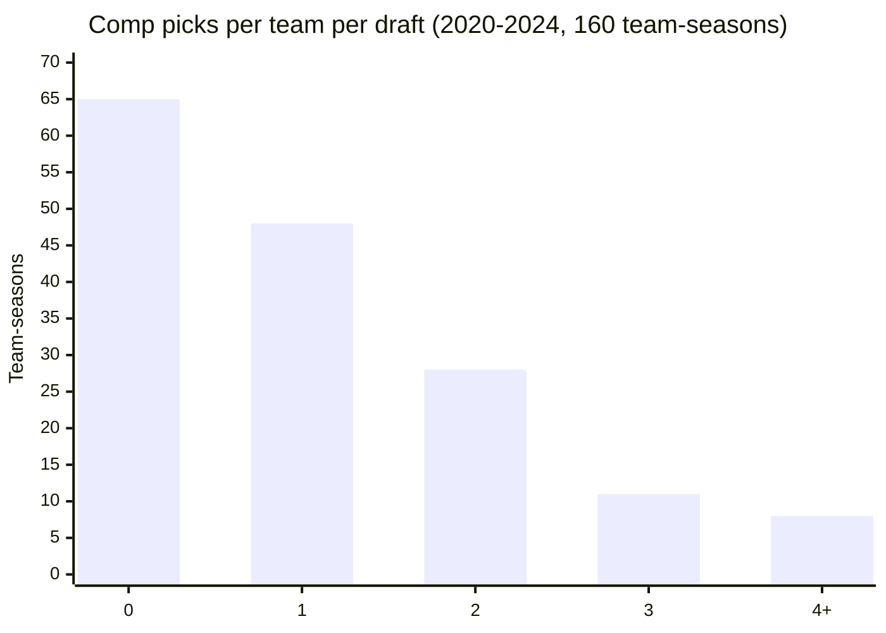
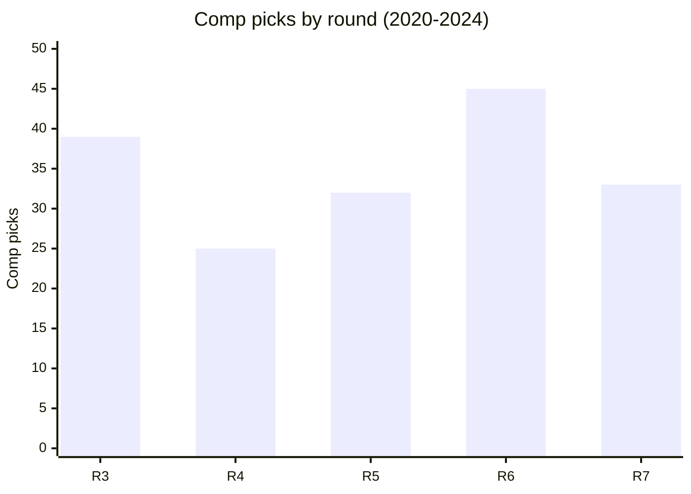
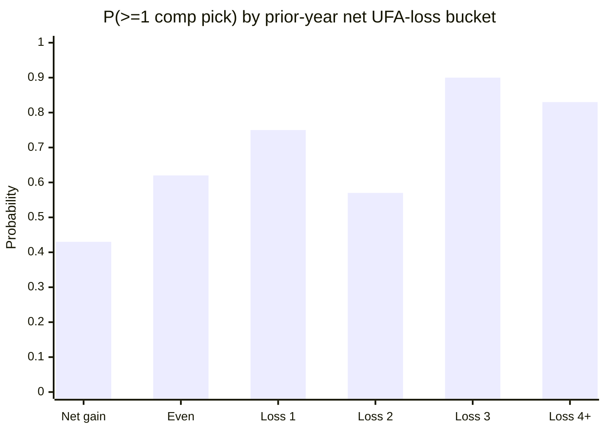

# NFL Compensatory Draft Picks — Allocation, Formula, and Sim Approximation

A calibration reference for the Zone Blitz sim's compensatory draft pick
economy. Covers **how many comp picks are awarded per team per draft**, **in
which rounds**, **how strongly net UFA losses predict a team receiving one**,
and **how often special (uncapped) minority-hire comp picks appear**.

Companion band: [`data/bands/comp-picks.json`](../bands/comp-picks.json).
Companion script: [`data/R/bands/comp-picks.R`](../R/bands/comp-picks.R). Gap
index row: [calibration-gaps.md #9 (#541)](./calibration-gaps.md).

## Sources

- `nflreadr::load_draft_picks()` — one row per drafted pick. The feed has **no
  explicit comp flag**; the script infers comp status from ordinal pick position
  within a round (`pos_in_round > 32` in rounds 3–7). Observed totals (31–38
  comp picks per year, 2020–2024) match NFL-reported counts.
- `nflreadr::load_contracts()` — OverTheCap contract feed, used to compute each
  team's prior-offseason **net qualifying UFA loss** by lagging a player's
  signing team across rows.
- League-rule cross-reference: the NFL's 2020 CBA introduced the 32-per-year
  league cap and the **supplemental minority-hire comp pick** (awarded to teams
  whose minority HC/GM/coordinator alums are hired away). Those picks sit
  **above** the 32-pick cap in rounds 3–4.
- Season window: **2020–2024** (post-CBA cap era).

## How comp picks work — the compressed version

The NFL awards up to **32 compensatory picks per draft**, spread across rounds
3–7, to teams that **lost more qualifying free agents than they signed** in the
prior league year. The league-run formula is confidential but three inputs are
well-understood:

1. **APY of each UFA** (signed with the new team).
2. **Snap share** the UFA plays in their first year with the new team
   (specifically, the formula is calculated after the season the player
   departed, using their stats with the new team).
3. **Postseason honors** — Pro Bowl and All-Pro selections add tier bumps.

Losses and gains **cancel within the same tier**: if a team loses a top-tier UFA
and signs a top-tier UFA, the gain nullifies the loss for comp-pick purposes. A
team only receives picks for the **net** unmatched losses, up to a maximum of
**four comp picks per team per year** (rare; most teams at the top of the
comp-pick standings get 2–3). The **round** of each comp pick reflects the tier
of the lost UFA: a top-tier loss triggers a round-3 comp; mid-tier a round 4 or
5; depth losses a round 6 or 7.

Two supplemental paths sit **outside the 32-pick cap**:

- **Minority-hire comp picks (since 2020)** — when a club's minority coach or
  front-office exec is hired as HC or primary football decision-maker by another
  club, the developing team gets a round-3 comp pick in each of the next two
  drafts. The 2023 extension added GM hires. These are **separate from the
  net-loss formula**.
- **Forfeited picks** (tampering, salary-cap violations) do not generate comp
  picks; they are redistributed to the punished team's draft board.

## What the band measures

### Comp picks per team per draft (0–4+ range)

Across 2020–2024 and all 32 teams (160 team-seasons):

| Comp picks | Team-seasons | Share |
| ---------- | ------------ | ----- |
| 0          | 65           | 40.6% |
| 1          | 48           | 30.0% |
| 2          | 28           | 17.5% |
| 3          | 11           | 6.9%  |
| 4+         | 8            | 5.0%  |

- **Mean**: 1.09 comp picks per team per draft.
- **SD**: 1.24.
- **Max observed**: 6 (Baltimore 2022 — the canonical "sign cheap, let vets walk
  for comp picks" roster-building archetype).



**About 40% of teams get shut out each draft.** These are typically teams that
were active in free agency (canceling their losses with gains) or who lost
players that didn't meet the APY/snap-share qualifying floor.

### Round distribution of comp picks

| Round | Comp picks | Share |
| ----- | ---------- | ----- |
| 3     | 39         | 22.4% |
| 4     | 25         | 14.4% |
| 5     | 32         | 18.4% |
| 6     | 45         | 25.9% |
| 7     | 33         | 19.0% |



Round 3 is **capped at 32 comp picks total** (the supplemental minority-hire
picks land here, which is why the round-3 count includes some that are
technically uncapped). Round 6 leads the count because **any qualifying mid-tier
loss that doesn't rank high enough for R3–R5 lands as R6/R7**, and the formula
rarely drops below round 7.

### P(team receives comp pick | prior-year net UFA losses)

Bucketing each team-season by its prior-offseason net qualifying UFA loss
(qualifying floor: APY ≥ $3M/yr; losses computed from `load_contracts()` by
lagging signing team):

| Net UFA losses (prior year) | Team-seasons | P(≥1 comp pick) | Mean comp count |
| --------------------------- | ------------ | --------------- | --------------- |
| Net gain (UFAs in > out)    | 54           | 0.43            | 0.59            |
| Even                        | 52           | 0.62            | 1.12            |
| Net loss of 1               | 24           | 0.75            | 1.67            |
| Net loss of 2               | 14           | 0.57            | 1.29            |
| Net loss of 3               | 10           | 0.90            | 1.70            |
| Net loss of 4+              | 6            | 0.83            | 1.50            |



The signal is directionally correct — more net losses → higher P(comp) — but
noisy because:

- The real formula cancels losses and gains **within tiers**, not by count. A
  team that loses 3 minimum-wage depth players and signs 1 mid-APY starter shows
  up here as "net loss 2" but gets 0 comp picks (the gain cancels the top of
  their loss stack).
- The $3M APY floor is a coarse proxy. The actual league floor changes annually
  and is tier-indexed.
- The "net gain" bucket still shows 43% comp rate because **the minority-hire
  supplemental picks are not tied to UFA activity** — a team can have no net
  loss and still receive a round-3 comp pick.

### Special (uncapped) comp pick frequency

Inferred as `total_comp_per_year − 32`:

| Draft year | Total comp picks | Inferred special (uncapped) |
| ---------- | ---------------- | --------------------------- |
| 2020       | 31               | 0                           |
| 2021       | 36               | 4                           |
| 2022       | 38               | 6                           |
| 2023       | 36               | 4                           |
| 2024       | 33               | 1                           |

Average: **~3 special comp picks per year** since 2020. The 2022 peak matches
the real-league count (6 minority-hire picks awarded to teams including
Baltimore, Pittsburgh, and New England).

## Formula narrative for the sim

The sim does **not** need to replicate the full APY + snap % + postseason
formula. The approximation:

```
per_team_comp_count = f(net_qualifying_UFA_losses, random_noise)
```

where `net_qualifying_UFA_losses` is the team's count of UFAs lost at AAV ≥
~$3M/yr, minus qualifying UFAs signed, with a tier-weighted cancellation (a
top-10 loss is cancelled only by a top-10 signing; a top-25 loss by anything
top-10 or top-25; and so on).

### Recommended sim algorithm

1. **At offseason start**, for each team tally `qualifying_losses` and
   `qualifying_gains` at each of four APY tiers (top_10, top_25, top_50, rest).
2. **Cancel losses against gains greedily** from top tier downward: each gain
   cancels the highest remaining untiered loss.
3. **Net remaining losses** → number of comp picks the team will receive, capped
   at 4.
4. **Assign rounds** by the tier of each surviving loss:
   - top_10 or top_25 loss → round 3 comp pick
   - top_50 loss → round 4–5 (50/50)
   - rest-tier loss at APY ≥ $3M → round 6–7 (50/50)
5. **Enforce the 32-pick league cap**: if the sum across all teams exceeds 32,
   drop the lowest-round picks until at 32. (In practice the formula rarely
   triggers more than 32; the cap bites in ~1/5 drafts.)
6. **Add supplemental minority-hire comp picks** separately — these aren't
   driven by UFA activity and should be modeled as an event in the coaching
   carousel loop, not the FA loop. ~3 per year on average.

### What the sim should NOT try to model

- The literal league formula (it's confidential and the inputs drift yearly).
- Snap-share as a direct comp-pick input — use the sim's tier output instead,
  which already reflects player quality via APY.
- Pro Bowl / All-Pro bumps on comp-pick tier — subsumed by the tier-of-loss
  mapping above.
- Exact round within the 3–7 band — the observed round distribution is noisy (R6
  > R3, which contradicts the "bigger loss = higher round" rule, because the
  > formula awards round based on the best comparable in the league that year,
  > not absolute APY).

## What the sim should do with this band

1. **Offseason GM decisions** — when evaluating whether to re-sign a departing
   UFA vs. let them walk, the AI GM should factor in the **expected comp pick
   value** (P(comp | projected tier) × trade-chart value of that round). For a
   mid-tier starter, the comp pick is usually a round-4/5, worth ~80 trade-value
   points per the Rich Hill chart — enough to tip the "let him walk" decision at
   the margin.
2. **Draft pick supply** — each season's draft board should include ~32 ± 3
   extra picks in rounds 3–7, allocated per step 4 above.
3. **Minority-hire comp pick event** — when an NPC team's minority coordinator
   is promoted to HC by another NPC team, award the developing team a round-3
   pick in each of the next two drafts. Do not count these against the 32-pick
   cap.

## Known gaps / follow-ups

- **Tier-weighted cancellation is not measured here** — we bucket by net count
  only. Filing a follow-up to extract per-player comp eligibility from OTC's
  Free Agent Tracker would let us measure per-tier cancellation empirically.
- **Snap-share as a qualifying input** — the sim can ignore (tier-of-APY is a
  good proxy for eventual snap share), but the real formula drops a tier if the
  UFA's year-1 snap share falls below ~25%.
- **Comp picks awarded → actually used** — trades of comp picks were banned
  until 2017, and even now teams tend to keep them. The sim can treat comp picks
  as tradable like any other pick; this mirrors post-2017 behavior.
- **The 2023 international-player pathway picks** show up in the
  uncapped-special total but are allocated by a different rule; they're rare
  enough (1 pick in 2023) to ignore at sim scale.
