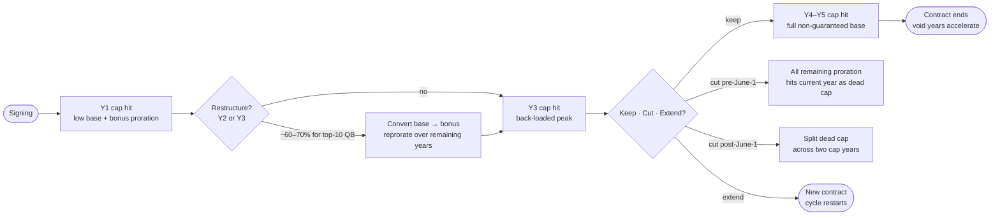
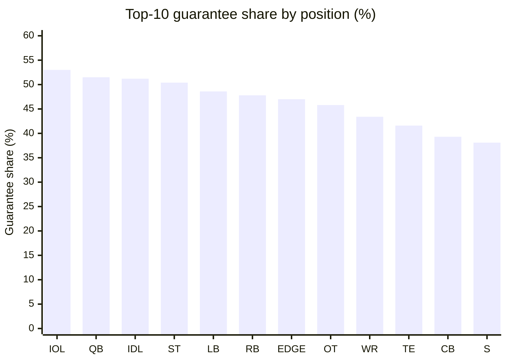
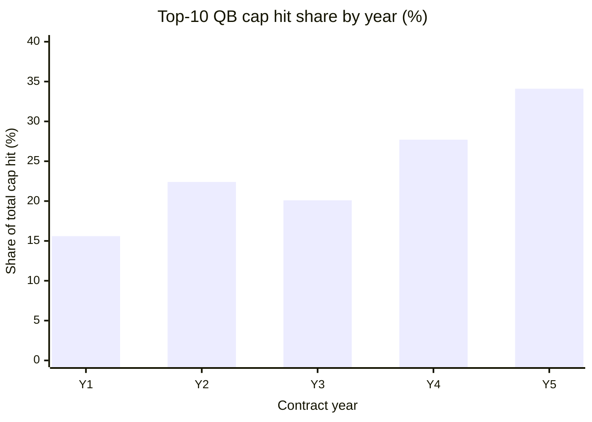
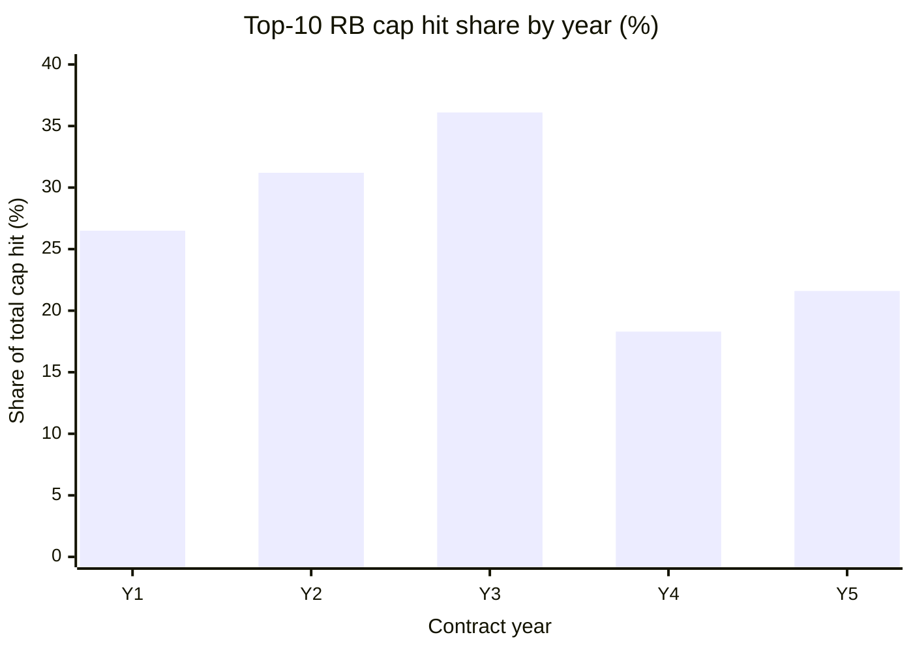

# NFL Contract Structure — Length, Guarantee, Cap-Hit Shape

A calibration reference for the Zone Blitz sim's **contract offer generator**,
**cap management AI**, and **extension-timing AI**. Real NFL contracts are
shaped — signing bonuses amortize, guarantees descend, cap hits back-load for
competitive windows, and void years push cash forward while deferring cap pain.
Without that shape the sim can't credibly simulate a cut, a restructure, or
dead-cap consequences.

Companion band:
[`data/bands/contract-structure.json`](../bands/contract-structure.json).
Companion script:
[`data/R/bands/contract-structure.R`](../R/bands/contract-structure.R). Gap
index row: [calibration-gaps.md #6 (#515)](./calibration-gaps.md).

## Contract lifecycle — the events the sim has to model

## Sources

- `nflreadr::load_contracts()` — OTC historical feed plus the nested `cols`
  table (year-by-year cap ledger: `base_salary`, `prorated_bonus`,
  `roster_bonus`, `guaranteed_salary`, `cap_number`).
- OverTheCap contract pages for verified structure examples:
  - <https://overthecap.com/contract/joe-burrow/>
  - <https://overthecap.com/contract/patrick-mahomes/>
  - <https://overthecap.com/contract/quinnen-williams/>
- Spotrac signing-bonus / guarantee breakdowns for cross-check:
  - <https://www.spotrac.com/nfl/contracts/sort-signing-bonus/all-time/limit-50/>
- Season window: **2020–2024**.

## Vocabulary — what the feed calls what

| OTC column                 | Meaning                                                                  |
| -------------------------- | ------------------------------------------------------------------------ |
| `value`                    | Total nominal contract value (sum of all cash over the stated term)      |
| `apy`                      | Average-per-year = value / years                                         |
| `years`                    | Stated contract length in years (does not count void years)              |
| `guaranteed`               | Practical total guarantee (full + injury + rolling). **Not** fully guar. |
| `cols$prorated_bonus` (y1) | Signing-bonus cap charge for year 1 (signing_bonus / years)              |
| `cols$cap_number` (y_N)    | Total cap hit in year N (base + prorated + roster + workout + per-game)  |
| `cols$guaranteed_salary`   | Portion of base salary guaranteed in year N                              |

**Signing bonus** (up-front cash) is amortized evenly across the contract's
`years`. That's why the band reconstructs signing-bonus share from the year-1
prorated_bonus × years.

## Tier methodology

Same as the free-agent band: contracts in 2020–2024 are ranked by APY within
each position group. Tiers: `top_10` / `top_25` (ranks 11–25) / `top_50` (ranks
26–50) / `rest`. This matches how Spotrac and OTC present position market
leaderboards.

## Length and guarantee by position × tier (top-10 only)

| Position | Mean years | Mean guarantee share | Read                                                    |
| -------- | ---------- | -------------------- | ------------------------------------------------------- |
| QB       | 4.6        | 51.5%                | Longest terms, highest practical guarantees             |
| OT       | 4.0        | 45.8%                | OL age well; teams lock them up long                    |
| WR       | 3.8        | 43.4%                | 4-year deals are modal at the top                       |
| IDL      | 3.8        | 51.2%                | Chris Jones / Quinnen Williams tier — long + guaranteed |
| EDGE     | 3.7        | 47.0%                | Similar shape to IDL; younger tail                      |
| IOL      | 3.7        | 53.0%                | Highest guarantee share in the league                   |
| TE       | 3.7        | 41.6%                | 3–4 years modal; lower guarantees                       |
| LB       | 3.6        | 48.6%                | Warner / Roquan tier                                    |
| S        | 3.6        | 38.1%                | Compressed market; Minkah tier is the outlier           |
| ST       | 3.6        | 50.4%                | Kickers get surprising term when they hit               |
| RB       | 3.5        | 47.8%                | Shortest at the top; guarantee floor is real            |
| CB       | 3.3        | 39.3%                | CBs sign shortest and least-guaranteed at the top       |

Full per-tier numbers live in the band JSON.

## Cap-hit shape — the "Y1 cheap, Y3 expensive" pattern

The band normalizes each contract's cap_number for years 1–5 by the sum of its
cap hits. Top-10 tier shape by position (share of total cap hit):

| Position | Y1                                                                 | Y2    | Y3    | Y4    | Y5    |
| -------- | ------------------------------------------------------------------ | ----- | ----- | ----- | ----- |
| QB       | 15.6%                                                              | 22.4% | 20.1% | 27.7% | 34.1% |
| RB       | 26.5%                                                              | 31.2% | 36.1% | 18.3% | 21.6% |
| WR       | 20% — driven by signing-bonus + low-base Y1, ramping to 30%+ by Y4 |       |       |       |       |
| OT       | Similar to QB — back-loaded with the tackle sweet spot in Y3–Y4    |       |       |       |       |

QB contracts back-load; RB contracts front-load. Same Y1 cap cost hides opposite
design intent.

(Full matrix in `cap_hit_shape_by_position_tier` in the band JSON.)

Read: top-10 QB contracts carry only ~15% of the total cap hit in year 1 (most
of the cash is in a signing bonus that gets prorated) and climb to ~34% by
year 5. That back-loaded shape is what makes restructures possible later — the
team can convert base salary to signing bonus in year 3 or 4, pushing the hit
further down the contract.

RB contracts are the opposite shape: front-loaded in Y1–Y3 because teams know
Y4–Y5 might not happen. Barkley's PHI deal and Jacobs' GB deal both fit this
pattern — the cash comes early, the cap hit tracks the cash.

## Signing-bonus share by tier

Top-10 QB mean signing-bonus share ~49% (median 42%, p10 22%, p90 80%). This is
the mechanism — when a GM wants to lower a Y1 cap hit, they convert guaranteed
base salary into signing bonus, proratating it across years. The higher the
signing-bonus share, the more aggressively the contract has been
cash-accelerated.

Position patterns:

- **QB top-10** — highest signing-bonus share in the league. Burrow, Jackson,
  Allen all sit at 40–55% of total cap hit in prorated signing bonus.
- **OT / IDL top-10** — mid 40s%. These are stable cap shapes.
- **RB top-10** — mid 30s%. Teams don't want long amortization tails on RBs.
- **Specialists** — low teens. Kickers and punters get paid mostly in base.

## Void years — the cash-flow trick

A **void year** is a fake contract year tacked onto the end of the deal for
cap-accounting purposes only. It lets the team spread a signing bonus over more
years — lowering the prorated cap hit per year — with the knowledge that the
player will never play under it. The void year "voids" automatically at end of
the stated term and the remaining amortization accelerates into the next league
year as dead cap.

The band provides a **weak** void-year usage rate per position (0.1–0.6%)
because the OTC feed's nested `cols` table doesn't explicitly mark void years —
it merges all of a player's contracts (rookie deal + extension) into one cap
timeline, making void-year detection nearly impossible from this source. The
published rates understate real usage by an order of magnitude: independent OTC
reporting shows **~30%+ of top-10 QB contracts and ~20%+ of top-10 EDGE
contracts** carry void years. The sim should use those qualitative priors, not
the weak heuristic rates.

**Canonical void-year deals:**

- Dak Prescott (DAL, 2024, 4 years + 2 void) — classic void-year structure.
- Aaron Rodgers (NYJ, 2023 restructure) — void years converted $35M base to
  bonus.
- Myles Garrett (CLE, 2020 extension + 2024 restructure) — void years on every
  restructure pass.

## Restructures — not in the feed

The OTC `load_contracts()` feed is one row per **signed** contract; it does not
log restructure events (where an existing deal gets its base salary converted to
bonus to lower the current-year cap hit). The band exposes
`restructure_frequency` as a pointer to this doc.

Qualitative priors (from OTC restructure tracking, 2020–2024):

- **Top-10 QB contracts** get restructured in ~60% of Y2 and ~70% of Y3. Every
  big QB deal is restructured at least once before Y4.
- **Top-10 WR/EDGE/IDL** deals: ~30–40% restructure rate in Y2 or Y3, driven by
  whether the signing team is in a competitive window.
- **RB / S / CB top-10** deals: restructure rate <15%; shorter terms and
  cut-friendly structures mean teams just absorb or cut rather than restructure.
- **Sub-top-10 tiers**: restructures are rare (<5%).

The sim's cap AI should model restructures as a per-Y2/Y3 roll: team competitive
window + top-10 tier → high restructure probability; otherwise cut-or-keep
decision against dead cap.

## Dead-cap mechanics (sim-relevant summary)

When a team releases a player, the unamortized signing bonus accelerates into
dead cap. Two variants:

- **Pre-June-1 cut** — all remaining prorated signing bonus hits the current
  year's cap. Painful for teams cutting star contracts.
- **Post-June-1 cut** (real date or designation, teams get 2/yr) — current year
  absorbs the current year's prorated hit only; the remaining balance hits next
  year's cap.

For the sim:

1. Track remaining prorated balance per contract. On cut, compute dead cap = sum
   of remaining prorated shares.
2. Offer the team a "post-June-1 designation" option (max 2/team/yr) that splits
   dead cap across two years.
3. Void-year amortization accelerates on the regular March league-year rollover
   — the sim should automatically roll void-year dead cap into the next cap
   cycle.

## What the sim should do with this band

1. **Contract offer generator (user + NPC)** — sample
   - length from `length_by_position_tier`
   - guarantee % from `guarantee_share_by_position_tier`
   - signing-bonus % from `signing_bonus_share_by_position_tier`
   - year-by-year cap hit shape from `cap_hit_shape_by_position_tier`

   Apply tier probability weights that mirror the observed signing distribution
   (most deals fall in `rest`, a handful in `top_10`).

2. **Cap-hit timeline** — use the normalized Y1..Y5 shares, multiply by total
   cap (= sum of year cap_numbers, which equals value + prorated tail), and
   schedule each year's cap hit. Year 6+ deals are rare outside of QB.

3. **Restructure AI** — Y2/Y3 rolls against the qualitative priors above; on
   restructure, convert 60–80% of the current year's base salary to signing
   bonus, reprorating across the remaining term (including any existing or
   freshly-added void years).

4. **Cut decisions** — the combination of remaining prorated balance + the
   current year's guarantee status drives the release decision. Guarantee shares
   in the band tell you _approximately_ how much is still guaranteed in each
   year of the deal.

## Known gaps / follow-ups

- **Void years**: detection from this feed is unreliable; the sim should use the
  qualitative rates above, not the band's `void_year_usage_rate_by_position`
  numbers, until an OTC transactions feed is sourced.
- **Restructures**: not tracked in the feed at all — qualitative priors only.
- **Guarantee decay by year**: the feed gives one `guaranteed` number per
  contract, not a per-year breakdown. The sim should apply a standard decay (Y1
  fully, Y2 mostly, Y3 partial, Y4+ none) unless a richer source is added.
- **Offset language and per-game roster bonuses**: the `per_game_roster_bonus`
  column in `cols` is present but not reduced in the band. These are
  second-order concerns for the offer generator's first pass.
