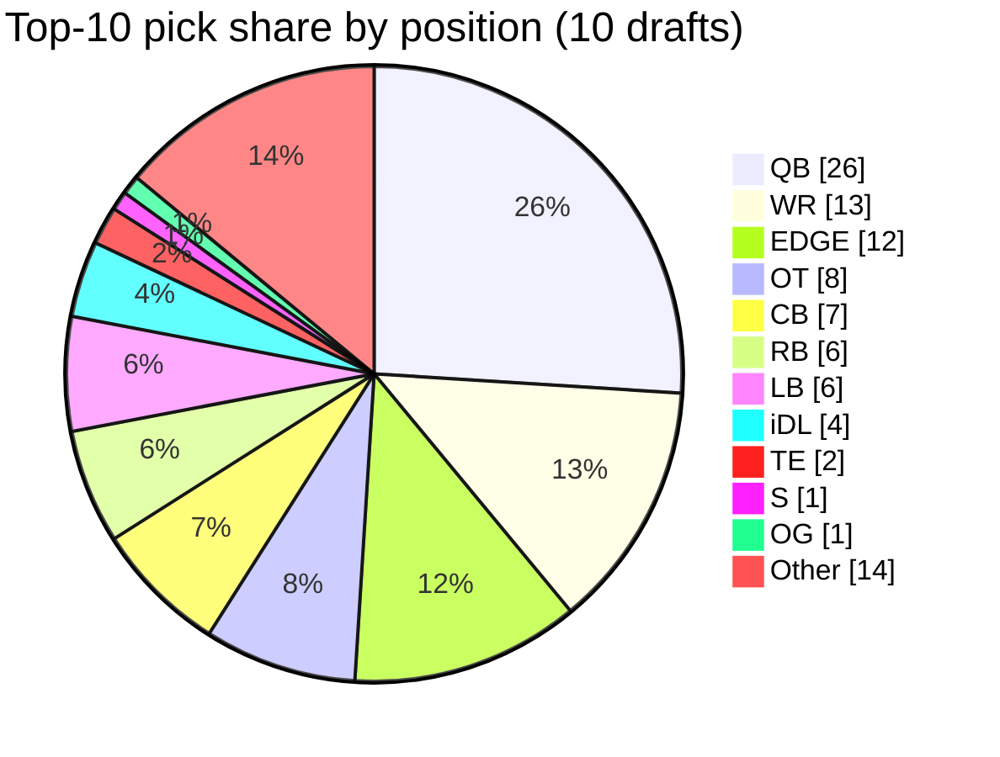
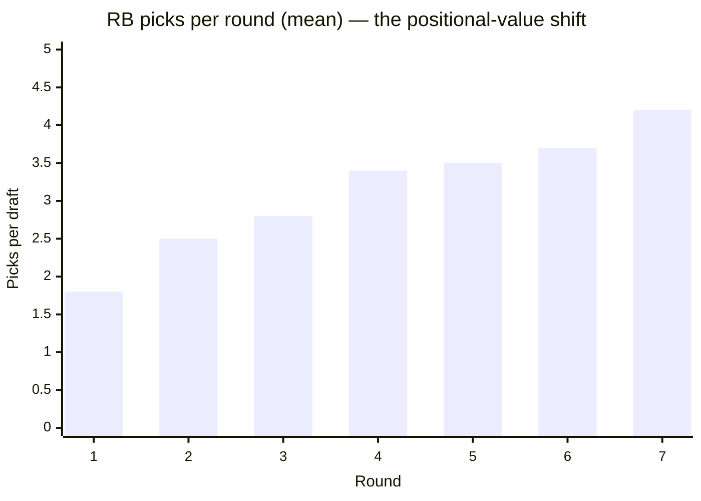
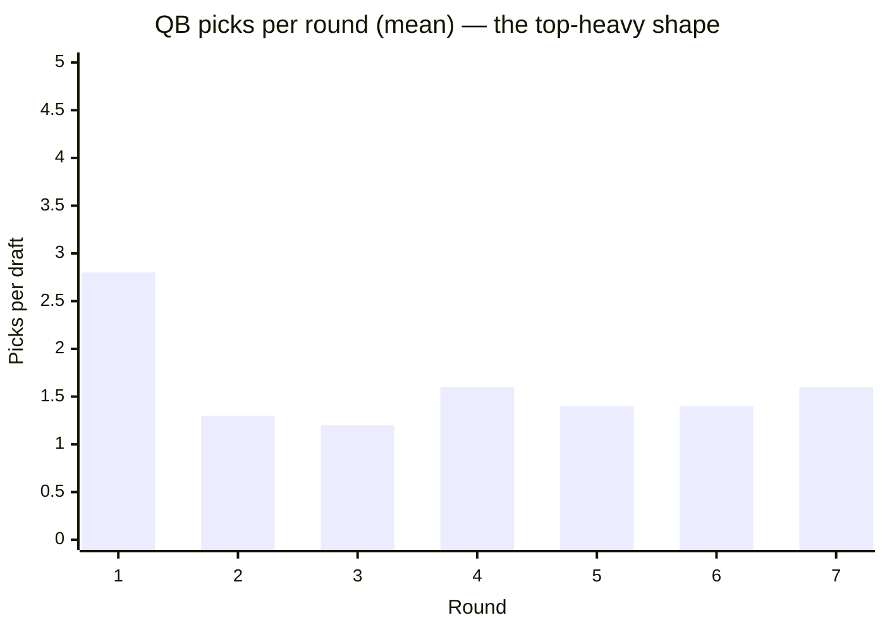

# Draft Position Tendencies

A working reference for how the real NFL distributes positions across the seven
rounds of the draft. The Zone Blitz draft-class generator uses these as priors:
QBs and EDGE dominate the top of round 1, late rounds skew toward specialists
and developmental OL / LB.

Numbers come from
[`data/bands/draft-position-distribution.json`](../bands/draft-position-distribution.json)
(seasons 2015–2024, ten drafts = ~2,550 picks). See the R script at
[`data/R/bands/draft-position-distribution.R`](../R/bands/draft-position-distribution.R).

## Premium positions dominate the top

Share of picks in each tier (pooled across 10 drafts):

| Position | Top-10 share | Top-32 share | Top-64 share | Full-draft share |
| -------- | -----------: | -----------: | -----------: | ---------------: |
| QB       |    **26.0%** |         ~13% |          ~8% |             4.4% |
| WR       |        13.0% |         ~16% |         ~15% |            12.7% |
| EDGE     |        12.0% |         ~12% |         ~10% |             7.7% |
| OT       |         8.0% |          ~9% |          ~8% |             5.4% |
| CB       |         7.0% |         ~10% |         ~11% |             9.3% |
| iDL      |         4.0% |          ~8% |          ~9% |             9.4% |
| RB       |         6.0% |          ~4% |          ~5% |             8.5% |
| LB       |         6.0% |          ~6% |          ~7% |             8.6% |
| TE       |         2.0% |          ~3% |          ~4% |             5.6% |
| S        |         1.0% |          ~3% |          ~5% |             6.1% |
| OG       |         1.0% |          ~2% |          ~3% |             3.6% |
| OC       |         0.0% |          ~1% |          ~1% |             1.9% |
| K/P/LS   |         0.0% |           0% |          ~0% |             1.8% |

**The rule of thumb:** QB, WR, EDGE, OT, CB are the premium-pick positions.
Together they account for roughly 65% of the top 10 but only 40% of the full
draft. Everything else (RB, TE, iDL, LB, S, OL interior, specialists) is
disproportionately late.

## Per-round picks per position (mean)

Across the seven rounds, mean picks per position per draft:

| Position |  R1 |  R2 |  R3 |  R4 |  R5 |  R6 |  R7 |
| -------- | --: | --: | --: | --: | --: | --: | --: |
| WR       | 4.3 | 4.5 | 5.0 | 4.4 | 5.0 | 4.2 | 5.2 |
| iDL      | 2.0 | 2.7 | 3.3 | 3.6 | 3.9 | 3.6 | 5.1 |
| CB       | 3.4 | 3.4 | 2.8 | 3.8 | 3.6 | 3.4 | 3.5 |
| LB       | 2.2 | 2.8 | 2.7 | 3.5 | 3.4 | 3.7 | 3.8 |
| RB       | 1.8 | 2.5 | 2.8 | 3.4 | 3.5 | 3.7 | 4.2 |
| EDGE     | 3.4 | 2.6 | 2.5 | 2.4 | 2.8 | 2.8 | 3.3 |
| S        | 1.0 | 1.7 | 1.8 | 2.3 | 2.4 | 2.9 | 3.6 |
| OT       | 2.4 | 2.0 | 1.6 | 1.6 | 1.8 | 2.0 | 2.5 |
| TE       | 1.2 | 1.6 | 1.8 | 2.0 | 2.3 | 2.5 | 3.0 |
| OL       | 0.8 | 1.9 | 2.3 | 2.7 | 2.5 | 2.7 | 2.9 |
| QB       | 2.8 | 1.3 | 1.2 | 1.6 | 1.4 | 1.4 | 1.6 |
| OG       | 0.4 | 1.2 | 1.2 | 1.5 | 1.6 | 1.6 | 1.8 |
| OC       | 0.2 | 0.6 | 0.7 | 0.7 | 0.7 | 0.8 | 1.1 |
| P/K      | 0.0 | 0.0 | 0.1 | 0.2 | 0.3 | 0.5 | 0.9 |

(Rounded to nearest tenth. Full distributions with p10/p50/p90 are in the band
JSON.)

RB more than doubles its R1 count by R7; QB peaks hard in R1 then flattens.
These are the two clearest positional-value stories in the last decade of
drafts.

### Positional run phenomena to model

- **QB runs (round 1).** Mean 2.8 QBs per R1, p10 = 1, p90 = 4. When a single QB
  goes in the top 5, a second usually follows within 10 picks. The sim's NPC
  draft AI should weight QB-need teams toward trading up when 3+ QBs are
  projected to R1.
- **OT/EDGE top-10 clusters.** When an OT or EDGE is the first non-QB off the
  board, the next 15 picks tend to be 40–50% other OTs and EDGEs.
- **WR steady-state.** WR is the one position with near-flat picks per round
  (4–5 in every round). No "WR run" because you can always find a WR.
- **Late-round RB / LB bias.** RB and LB both more than double their R1 pick
  counts by R7. This is the clearest example of positional-value revolution:
  teams stopped paying early capital for RB/LB in the last decade.
- **Kickers/punters live in R6–R7 only.** Treat a K or P picked before R6 as a
  major story-beat in the sim.

## Top-of-draft concentration highlights

Pooled across the 10-draft window:

- **Top-10 picks are ~65% QB/WR/EDGE/OT/CB.**
- **A QB goes in the top 10 ~2.6 times per draft** (260 / 10 drafts × 10 picks).
  The modal R1 QB count is 2.
- **Only 2 TEs and 1 S were picked in the top-10 across 10 years.** Premium
  position rules are near-absolute at the very top.

## Sim implications

1. **Draft class generator** should draw round × position counts from the
   per-round distributions in the band, not uniformly.
2. **NPC GM positional-value prior** should match the top-10 concentration: a
   QB-needy team with pick 3 is ~5x more likely to draft QB than a random
   position.
3. **Big board spread** — QBs/OTs have high variance in where they land (p10–p90
   of R1 QB count is 1–4). The sim should reflect that draft-day QB runs are the
   single biggest source of board-movement volatility.
4. **Positional scarcity feedback loop** — the full-draft share column is the
   eventual-supply pipeline into the league. Compare against the
   [position market sizing](./position-market-sizing.md) to validate that draft
   inflow ≈ career-length-attrition outflow per position.

## Sources & caveats

- `nflreadr::load_draft_picks(2015:2024)`.
- Position canonicalization: PFR's `position` column, normalized via the same
  vocabulary as other bands. `OLB` is reported as its own bucket (`EDGE_or_LB`)
  because PFR inconsistently splits 3-4 rush backers from off-ball linebackers.
- Rounds 1–7 only. Supplemental and pre-2017 compensatory quirks excluded.
- Draft class size varies (~253–262 picks per draft); per-round totals are not
  always exactly 32.
