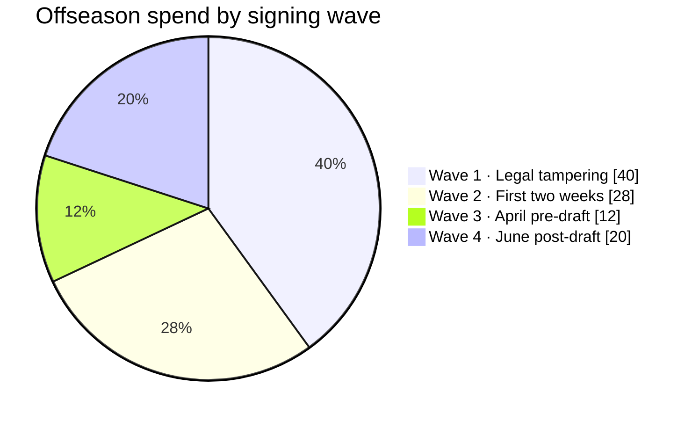
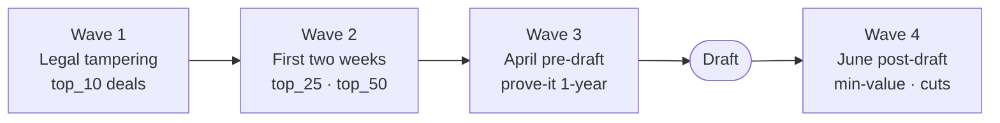
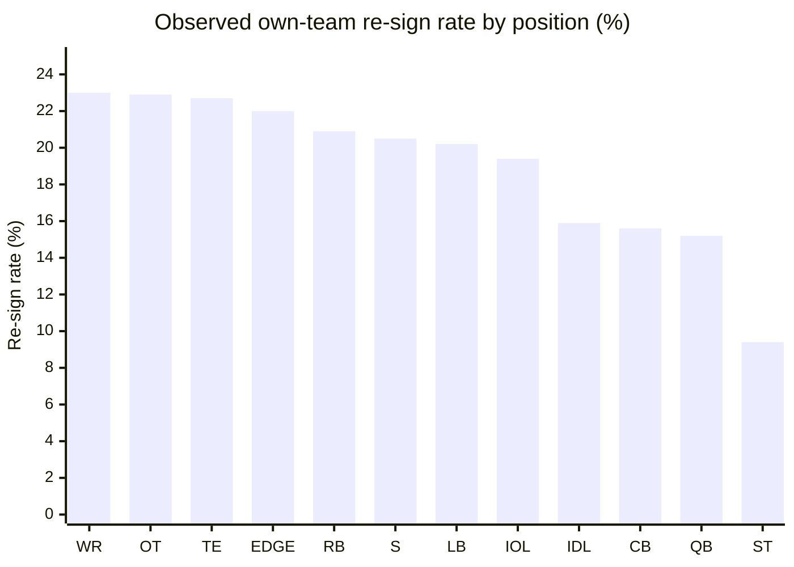

# NFL Free Agent Market — Volume, AAV, and Signing Waves

A calibration reference for the Zone Blitz sim's free agent period. Covers **how
many UFAs sign per offseason**, **at what AAVs by position and tier**, **when in
the calendar signings happen**, and **how often players re-sign with their
drafting team** vs. leave in free agency.

Companion band:
[`data/bands/free-agent-market.json`](../bands/free-agent-market.json).
Companion script:
[`data/R/bands/free-agent-market.R`](../R/bands/free-agent-market.R). Gap index
row: [calibration-gaps.md #5 (#514)](./calibration-gaps.md).

## Sources

- `nflreadr::load_contracts()` — OverTheCap historical feed, one row per signed
  contract (`player`, `position`, `team`, `year_signed`, `years`, `value`,
  `apy`, `guaranteed`, `draft_team`).
- Spotrac position leaderboards — cross-checked for top-of-market AAVs.
  - <https://www.spotrac.com/nfl/rankings/player/_/year/2024/sort/contract_value>
  - <https://www.spotrac.com/nfl/rankings/player/_/year/2024/position/qb/sort/cap_average>
- OverTheCap market pages — cross-checked for tier boundaries.
  - <https://overthecap.com/position/>
- Season window: **2020–2024** (post-COVID-cap era).

## What counts as a "UFA signing" in the band

The OTC feed does not tag contracts as rookie / extension / UFA, so the band
uses a heuristic:

- **External UFA signing** = `team != draft_team` and
  `year_signed > draft_year`. This captures veterans who changed teams.
- **Own-team re-sign** = `team == draft_team` and `year_signed > draft_year`.
  Captures extensions and "re-sign before hitting the market" deals; _does not_
  distinguish between a clean extension and a UFA who came back.
- **Rookie deals** (`year_signed == draft_year` with the drafting team) are
  excluded from UFA volume metrics but included in AAV-tier ranking so that
  rookie-scale contracts don't distort the top-tier pool.

This means "external UFA volume" per offseason overshoots the canonical "veteran
UFA market" count (which PFF puts at ~200–250 meaningful deals/yr) because the
feed includes practice-squad signings, futures contracts, ERFA tenders, and
minimum-salary depth churn. The **relative shape across positions is what the
sim should anchor on** — not the absolute row count.

## The three market tiers

The band ranks all contracts in the 2020–2024 window by APY within each position
group and buckets them:

- **`top_10`** — franchise-tier APYs. For QBs, these are the Burrow / Allen /
  Jackson / Herbert / Hurts / Prescott extensions. For RBs, McCaffrey / Barkley
  (pre-cut). For WRs, Jefferson / Tyreek / CeeDee.
- **`top_25`** (ranks 11–25) — clear-starter market. WR2/WR1 tier, starting CBs,
  starting OTs.
- **`top_50`** (ranks 26–50) — mid-market starters and first-contract veterans
  hitting the open market.
- **`rest`** — depth, specialists, camp bodies, minimums.

The sim's NPC GM FA bidding AI should sample APY from the tier's
`mean_apy_millions` / `median_apy_millions` fields, bounded by
`floor_apy_millions` and `ceiling_apy_millions`, with length sampled from
`contract_length_years_external`.

## Position-market narratives

### Quarterback — franchise tag or bust

- Top-10 APY floor ~\$40M+/yr. Burrow (5/\$275M), Jackson (5/\$260M), Herbert
  (5/\$262.5M), Hurts (5/\$255M), and Prescott (4/\$240M) all reset the market
  between 2023 and 2024.
- Mid-market QBs almost never hit open FA — they get franchise-tagged (Prescott,
  Jackson) or extended on cheap "bridge-veteran" deals (Tannehill, Cousins
  year-to-year). Purely "external" QB signings are overwhelmingly backups.
- Re-signing rate on vet QB deals in the band is the _lowest_ of any offensive
  position group (~15%) because the feed treats "one-year backup pitstop"
  signings as external, which dominates the QB row count.

### Running back — short, guarantee-light, post-Barkley

- RB is the position where the market most visibly punishes length. Barkley
  (3/\$37.75M with PHI, 2024) and Jacobs (4/\$48M with GB) were considered
  market corrections upward after a brutal 2023 FA cycle.
- Top-10 RB mean years ~3.5 and guarantee share ~48% — the lowest length among
  skill positions.
- RB1/RB2 separation matters: backups routinely sign 1-year/\$1–2M minimums
  after Week 1 cutdowns.

### Wide receiver — the deepest market

- WR has the most external signings per offseason of any skill position (~425/yr
  in the band, driven by the volume of WR4-WR6 depth churn).
- Top-10 WRs are extended by their drafting team (Jefferson 4/\$140M with MIN,
  Chase 4/\$161M with CIN). The "open-market" top-tier WR deal is rare; when it
  happens (Tyreek trade-then-extend with MIA, 4/\$120M) it reprices the
  position.
- WR1 money is gated by the top-10 APY floor; WR2 money sits in top_25.

### Tight end — bimodal by role

- Kelce, Andrews, Kittle, LaPorta, Goedert top the APY table; blocking-first TEs
  cluster in the `rest` tier.
- Top-10 guarantee share (~42%) runs lower than QB/WR because TEs have shorter
  healthy careers and teams hedge.

### Offensive line — OT premium, IOL compressed

- OT (LT/RT) top-10 APY runs well above IOL (LG/RG/C); Penei Sewell (4/\$112M),
  Trent Williams (3/\$69M), Laremy Tunsil (3/\$75M) anchor the OT market.
- IOL top-10 is headlined by Quenton Nelson (4/\$80M) and Joe Thuney deals, but
  compresses fast: a top-25 guard makes ~half of a top-10 tackle.
- OL contracts carry some of the **highest guarantee shares** (top-10 IOL at
  53%) because the position ages well and teams bet on continuity.

### EDGE and IDL — pay the elite, stream the rest

- Top-10 EDGE is QB-adjacent in APY: Bosa (5/\$170M), Parsons future extension,
  Watt (4/\$112M), Garrett (5/\$125M), Crosby (3/\$35.5M/yr).
- Mid-tier EDGE gets churned ruthlessly — 3–5 sack starters hit the market and
  accept 1-year "prove it" deals.
- IDL splits into the premium 3-technique archetype (Chris Jones 5/\$158.75M,
  Quinnen Williams 4/\$96M, DeForest Buckner 2/\$45M) and run-plugging NTs who
  sign modest 2-3 year deals.

### Secondary — CB premium, S commodity

- CB top-10 is paced by Ramsey, Sauce Gardner (rookie-deal), Diggs, Humphrey.
  Top-10 APY floor sits at the mid-\$20Ms.
- Safety top-10 runs ~20% below CB at the same tier, reflecting the position's
  commoditization. Minkah, Derwin James, Budda Baker anchor the top tier; the
  drop-off to top_25 is steep.
- CBs have the **second-lowest own-team re-sign rate** in the band (~16%) —
  cornerbacks move more than any other defensive starter.

### Specialists — the stickiest market

- K/P/LS contracts cluster tight (Tucker 4/\$24M, Butker 4/\$24.75M at the top;
  mid-market kickers at 2/\$6M).
- Own-team re-sign rate is the lowest in the band (~9%) largely because
  specialists churn on minimum 1-year deals and the "team" column flips with
  every cut-day signing, _not_ because they actually move a lot.

## Signing-timing waves

The OTC feed exposes `year_signed` but **not `date_signed`**. The band carries a
pointer here; wave rates are documented qualitatively for the sim to sample
until a dated feed is wired in.

Four canonical waves per offseason (NFL league-year opens mid-March):

1. **Legal tampering (day -2 → day 0)** — ~35–45% of the offseason's total spend
   and the vast majority of top-10-tier deals. Agreements leak Monday afternoon
   before the Wednesday league year; by Wednesday 4pm ET most top-tier FAs are
   off the board. This is where Kirk Cousins to ATL (4/\$180M, 2024), Tee
   Higgins franchise-tag, and Saquon Barkley to PHI all landed.
2. **First two weeks post-opening** — ~25–30% of spend. Tier 2 (top_25) and tier
   3 (top_50) sign here as teams fill out starting lineups.
3. **April bargain period (pre-draft)** — ~10–15% of spend. Veterans who didn't
   get their number take 1-year "prove-it" deals. High variance tier for
   mid-career players.
4. **June post-draft + training camp** — ~15–20% of spend by count, but mostly
   minimum-value deals. This is where cut-candidates from other teams land
   (post-June-1 designations free up real cap) and where UDFAs replace injured
   camp bodies.

Share numbers are from Spotrac / OTC year-over-year rollup reporting; they are
not computed from the band and should be treated as priors.

## Re-signing rate (own-team retention)

Observed in the 2020–2024 window, vet contracts only (excludes rookie deals):

| Position | Re-sign rate |
| -------- | ------------ |
| WR       | 23.0%        |
| OT       | 22.9%        |
| TE       | 22.7%        |
| EDGE     | 22.0%        |
| RB       | 20.9%        |
| S        | 20.5%        |
| LB       | 20.2%        |
| IOL      | 19.4%        |
| IDL      | 15.9%        |
| CB       | 15.6%        |
| QB       | 15.2%        |
| ST       | 9.4%         |

**Read with caveat:** the denominator includes every vet contract signed with
any team, including minimum-salary depth. The "own-team re-sign rate for a
**starting-caliber veteran**" runs meaningfully higher — closer to 35–45% on the
first FA trip for top_25-tier players. The sim should apply a tier multiplier
(top_10 → ~60% own-team retention via extension-before-FA, top_25 → ~45%, top_50
→ ~30%, rest → the observed rate above).

## What the sim should do with this band

1. **FA period generator** — pick a number of UFAs per position from
   `ufas_signed_per_offseason.by_position_group`, then sample APY by assigning
   each UFA to a tier (with weights top_10:top_25:top_50:rest ~= observed
   volumes) and drawing from the tier's `mean_apy_millions` / `sd` band.
2. **Waves** — distribute signings across the four waves using the doc's
   qualitative priors; top-tier contracts should concentrate in Wave 1.
3. **Own-team retention** — before a player hits the open market, roll the
   re-sign rate per position × tier; on success, the drafting team gets
   right-of-first-refusal at `mean_apy` with no open bidding.
4. **NPC GM bidding AI** — cap-strapped teams bid at `p10_apy`, cap-rich
   contending teams bid at `p90_apy`; sample bid length from
   `contract_length_years_external` with QB/OL skewing high and RB/S skewing
   low.

## Known gaps / follow-ups

- `date_signed` is not in the OTC feed — the waves band is qualitative. Filing a
  follow-up to scrape OTC "Free Agent Tracker" archival pages is tracked
  separately.
- Restricted / Exclusive Rights FA tenders are not tagged in this feed and blend
  into "own-team re-signs" (RFA tender) or the `rest` tier (ERFA).
- Franchise-tag / transition-tag contracts appear as 1-year `years == 1` with
  APY = the tag amount. The sim should treat them as a distinct contract type,
  not an FA signing.
