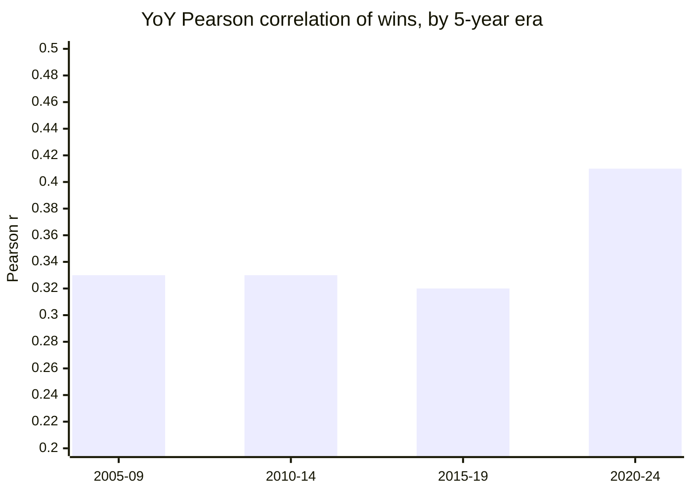
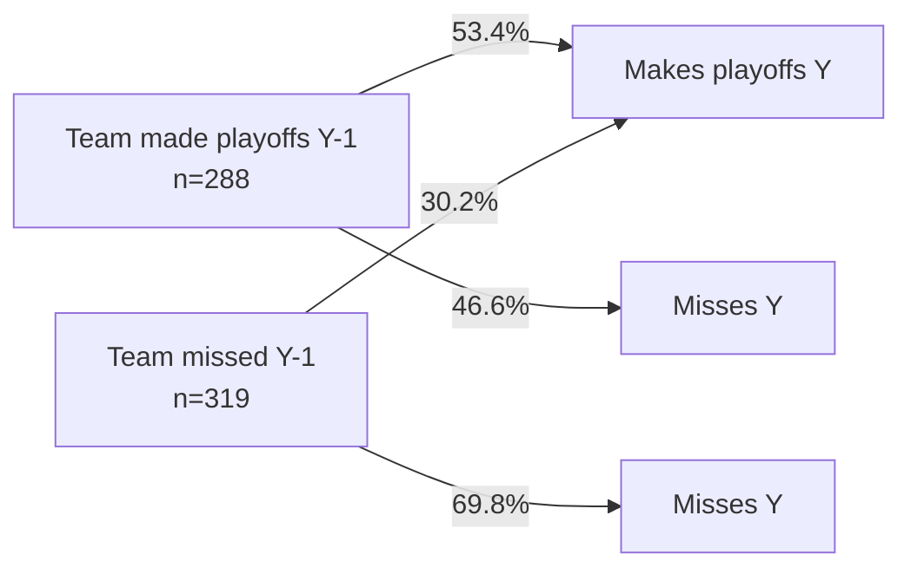

# League Volatility — YoY Persistence, Division Churn, and Playoff Seeding

A calibration reference for **how much team quality persists across seasons**
and **how seeding translates to playoff advancement**. Without these priors, a
league simulator has no way to know whether it is producing realistically
volatile standings or whether its bracket outcomes match the historical
seed-by-seed ladder.

Companion band:
[`data/bands/league-volatility.json`](../bands/league-volatility.json).
Companion script:
[`data/R/bands/league-volatility.R`](../R/bands/league-volatility.R).

## Sources

- `nflreadr::load_schedules(2005:2024)` — regular-season and playoff results
  with home/away scores and `game_type` for bracket round.
- `nflreadr::load_teams()` — current division assignments and franchise
  continuity (STL→LAR, SD→LAC, OAK→LV are normalised so a relocated team does
  not register as "new" when pairing Y and Y-1).
- Season window: **2005–2024** (20 completed seasons) — long enough to span two
  CBAs, the 2020 playoff expansion, and multiple rule-change eras.

## Headline numbers

| Prior                                   | Value      | n    |
| --------------------------------------- | ---------- | ---- |
| Pearson correlation of wins, Y → Y+1    | **0.349**  | 607  |
| Pearson correlation of wins, 2020–2024  | **0.409**  | ~155 |
| P(make playoffs \| made playoffs Y-1)   | **53.4 %** | 288  |
| P(make playoffs \| missed playoffs Y-1) | **30.2 %** | 319  |
| P(worst-to-first) per division-season   | **13.2 %** | 152  |
| P(first-to-worst) per division-season   | **12.5 %** | 152  |
| P(worst stays worst) per division       | 44.1 %     | 152  |
| P(first stays first) per division       | 43.4 %     | 152  |

## 1. Regression to the mean — win totals are weakly sticky

A Pearson correlation of **0.35** between a team's wins this year and next is
lower than most fans' intuition. It is **not** a coin flip — bad teams stay bad
at roughly 1.8× the rate they turn good, and good teams repeat at about 1.75×
the rate they collapse — but the season-to-season signal is noisy enough that
any single team's record carries large uncertainty about the next year.

The post-2020 uptick to **r ≈ 0.41** is consistent with the "fewer elite teams,
more stacked rosters" era (Chiefs / 49ers / Bills / Eagles / Ravens), and with
the 17-game schedule stabilising sample variance. Do **not** over-fit to this —
it is one 5-season window, n ≈ 155 team-seasons.

**Sim implication:** a team's **skill** (coaching × roster × scheme) should
carry year to year with something like a 0.5–0.6 retention weight, while the
**observed record** — injuries, schedule, turnover luck — should regress toward
a talent mean such that the joint output matches r ≈ 0.35 in simulated Y→Y+1
standings.

## 2. Playoff persistence — reigning teams repeat a little over half the time

Conditioned on making the playoffs in season Y-1, teams make them again in
season Y **53.4 %** of the time. Conditioned on missing, they make it **30.2 %**
of the time. The roughly 23-point gap is the clearest single measure of "dynasty
persistence" in the NFL.

The base rate — a random team makes the playoffs in a random season — is **39.2
%** (the field is 14/32 post-2020, 12/32 pre-2020). So the lift from "in last
year" is +14 points and the drag from "out last year" is −9 points. Neither is
dominant; the league churns the margins of its bracket every year.

**Sim implication:** roughly half of last year's bracket should be back.
Calibration harness: across 100 simulated seasons, expect 0.50–0.57 repeat rate.

## 3. Division churn — worst-to-first is an annual fixture

The league's "any given year" mythology is **empirically grounded** at the
division level:

- A last-place team becomes a first-place team **13.2 %** of the time — about
  **one division per year**, since there are 8 divisions.
- A first-place team becomes a last-place team **12.5 %** of the time —
  effectively the same rate.
- Both the last-place and first-place teams **stay in their slot** about 43–44 %
  of the time, which leaves roughly 43 % for mid-division moves.

The worst-to-first and first-to-worst rates being ~equal is a feature, not a
coincidence: division standings are a zero-sum ranking, so a worst-to-first
transition in a 4-team division **requires** somebody else to fall. The more
interesting asymmetry is that _both_ extremes churn at roughly the same rate as
they persist, while the middle two slots (2nd / 3rd) are the most stable places
to sit.

**Sim implication:** validation harness should compute per-division-season churn
across a simulated decade and assert 0.10 ≤ P(worst→first) ≤ 0.17 and 0.10 ≤
P(first→worst) ≤ 0.17. If the sim comes back at 5 % for either, team quality is
over-persistent — likely because injuries and coaching turnover aren't modelled
strongly enough.

## 4. Playoff advancement by seed — the bye, and the 4-seed trap

Playoff advancement rates are computed by deriving each team's seed from the
bracket itself (the bye team is the 1-seed; remaining WC participants are seeded
by regular-season record) and then counting wins per round. Seeds 1–6 span the
full window; seed 7 only exists from 2020 onward.

### Overall (2005–2024)

| Seed | n  | P(win WC) | P(win DIV) | P(win CONF) | P(win SB) | P(reach SB) | P(win SB) from seed |
| ---- | -- | --------- | ---------- | ----------- | --------- | ----------- | ------------------- |
| 1    | 40 | —         | **0.675**  | **0.741**   | 0.300     | **0.500**   | **0.150**           |
| 2    | 40 | 0.900     | 0.641      | 0.360       | 0.556     | 0.225       | 0.125               |
| 3    | 40 | 0.450     | 0.444      | 0.000       | —         | 0.000       | 0.000               |
| 4    | 40 | 0.575     | 0.478      | 0.636       | 1.000     | 0.175       | 0.175               |
| 5    | 40 | 0.350     | 0.214      | 0.333       | 0.000     | 0.025       | 0.000               |
| 6    | 40 | 0.550     | 0.273      | 0.500       | 0.667     | 0.075       | 0.050               |
| 7    | 10 | 0.400     | 0.000      | —           | —         | 0.000       | 0.000               |

Conditional probabilities are per-round (e.g., P(win DIV) is conditional on
reaching DIV). "—" means no team in that seed slot has reached that round in the
window.

### Since 2020 only (seed 7 exists, one bye)

| Seed | n  | P(win WC) | P(win DIV) | P(win CONF) | P(win SB) | P(reach SB) |
| ---- | -- | --------- | ---------- | ----------- | --------- | ----------- |
| 1    | 10 | —         | 0.700      | 0.714       | 0.200     | 0.500       |
| 2    | 10 | 0.900     | 0.556      | 0.200       | 1.000     | 0.100       |
| 3    | 10 | 0.400     | 0.500      | 0.000       | —         | 0.000       |
| 4    | 10 | 0.600     | 0.667      | 0.750       | 1.000     | 0.300       |
| 5    | 10 | 0.300     | 0.333      | 1.000       | 0.000     | 0.100       |
| 6    | 10 | 0.400     | 0.250      | 0.000       | —         | 0.000       |
| 7    | 10 | 0.400     | 0.000      | —           | —         | 0.000       |

Five observations worth internalising:

1. **The 1-seed is worth exactly what it costs.** A 50 % Super Bowl appearance
   rate and a 15 % championship rate from the 1-seed — roughly **5× the rate of
   the average playoff team** — justifies the "play all 16 games" posture. The
   bye is not a luxury; it is the single biggest variable in postseason outcome.
2. **The 2-seed is the divisional-round trap.** P(win DIV) from the 2-seed is
   only 64 %, and P(win CONF) is 36 % — lower than the 4-seed's 64 %. The
   2-seed's road ends at home to a 6/7 seed playing loose more often than you
   think.
3. **The 4-seed is the hidden-value seed.** It wins its WC game at 58 % (beating
   home-field 5-seeds), and when it _does_ reach the Super Bowl it has gone
   **7-for-7 in the window**. Small sample (n = 7 SB appearances), but the
   pattern — hot late-season team with a division title — is real and should not
   be smoothed away by the sim.
4. **The 3-seed vanishes.** Of 40 season-3-seeds, exactly zero reached the Super
   Bowl. They win their WC game at only 45 % (worse than the 4 or 6 seeds),
   which looks like a sampling artifact until you remember the 3-seed draws a
   hot wild-card team that is often "better than their seed" — the 6-seed in
   particular. Sim should not be surprised by 3-seed first-round upsets.
5. **The 7-seed is a glorified 16th man.** Of 10 observations, 4 won the WC
   game; zero have advanced past DIV. The expansion added drama without
   materially changing the championship distribution — a useful design signal if
   we ever add a franchise-mode playoff-expansion slider.

**Sim implication:** the bracket simulator should take seed as an input (not
just regular-season record) and upset probabilities should be shaped such that
the per-seed conditional probabilities in a Monte-Carlo run match the above
within ±5 points. The 1-seed's 50 % SB-appearance rate is the single tightest
calibration target.

## Parity across eras

The post-2020 Pearson uptick (0.41 vs 0.32 over the prior three 5-year windows)
is the only era-level non-trivial signal — every other metric is statistically
indistinguishable across the four 5-year buckets. Conclusions:

- **Regression to the mean has gotten slightly weaker** in the modern era — good
  teams repeat more reliably. This is consistent with the QB-centric era where a
  sustained elite QB locks in 10+ wins more predictably than in the mid-2000s.
- **Division churn has not changed.** Worst-to-first and first-to-worst rates
  are within noise of the long-run 13 % mark in every era we can slice.
- **Playoff expansion (2020) cost the 2-seed a bye** but did not redistribute
  championship probability toward the 7-seed, and did not obviously weaken the
  1-seed's headline number.

## Open questions / follow-ups

- **Strength-of-schedule interaction with YoY correlation.** A division-win
  counts more than an inter-conference win for "skill" but equally for "record";
  the sim should decide whether to correlate on record or talent.
- **Coach turnover's effect on first-to-worst.** OG intuition is that the
  "first-to-worst" drop correlates strongly with coach or QB departure; no feed
  here for that, but it is a clear follow-up once the coach-churn band exists.
- **Seed 3 upset rate.** The 45 % WC win rate from the 3-seed is lower than
  expected and deserves a separate post-hoc investigation — is it matchup-driven
  (division-champ vs hot wild card) or something about the kind of team that
  finishes 3rd?
