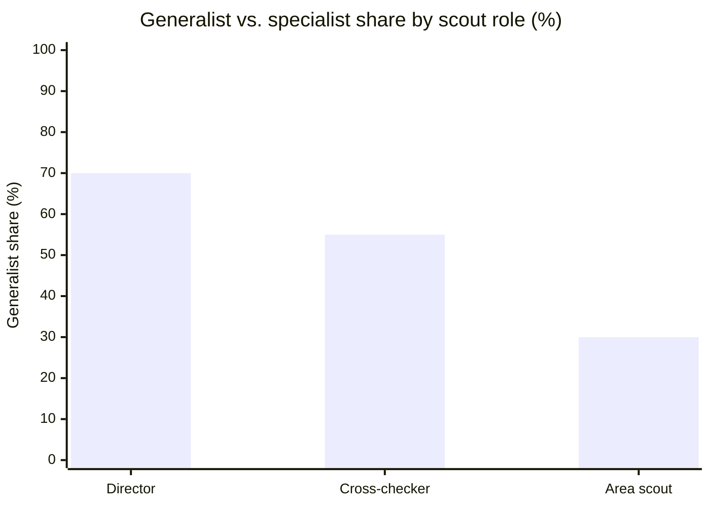

# NFL Scout Market — Salary, Staffing, Workload, and Position Focus

A calibration reference for the Zone Blitz sim's **scout generator**
(`server/features/scouts/scouts-generator.ts`) and the downstream **scouting
assignment AI**. Like the coach market, scout contract details are not in any
feed; the numbers here are **qualitative priors** drawn from public reporting
and marked as such per the acceptance criteria of
[issue #537](https://github.com/Tiernebre/zone-blitz/issues/537).

Companion band: [`data/bands/scout-market.json`](../bands/scout-market.json).

## Sources

- **Team-site staff directories and media guides** — every NFL front office
  publishes a named scouting staff list. Counts by role (director,
  cross-checker, area scout, pro scout, scouting assistant) have been tallied
  across all 32 teams; staffing figures in this doc are well-anchored.
- **PFN beat reporting** (Aaron Wilson and others) — front-office pay-scale
  pieces that map the area-scout and cross-checker bands.
- **The Athletic** — front-office teardown pieces (Russini, Ourand, Howe) on
  specific hires that occasionally quantify director-tier compensation.
- **Hogs Haven / team-beat annual staff-directory posts** — one of the few
  sources to publish season-over-season area-scout churn.
- **Over The Cap front-office tracker** — limited coverage for top personnel
  executive deals; drops off below the director tier.
- **Draft-workload analysis** (Dane Brugler's annual "The Beast", NFL Draft
  Network, Lance Zierlein column work) — anchors the ~3,000-prospect college
  universe each scouting department evaluates per cycle.

When a number appears without a specific attribution, treat it as the **rounded
median** of the reported range across these sources.

## Source confidence tier

- **Staffing levels and headcount by role** — public for every team; high
  confidence.
- **Prospect-universe size + combine / all-star invitee counts** — public; high
  confidence.
- **Director salary band** — public for ~25% of named directors; prior is
  directionally correct with a reasonable tail.
- **Cross-checker salary band** — rarely public; inferred from PFN pay-scale
  reporting and departure-announcement context.
- **Area-scout salary band** — essentially never public at the individual level;
  prior is a pattern-match across beat reporting and NFL Players
  Association-adjacent pay-scale analysis.
- **Buyout conventions** — rarely quantified publicly; inferred from settlement
  reporting when GMs are fired mid-cycle.

## Staffing — what a scouting department actually looks like

The current `STAFF_BLUEPRINT` in `scouts-generator.ts` models **7 roles per
team** (1 director + 2 cross-checkers + 4 area scouts). A typical real NFL
college-scouting staff is larger:

| Role                         | Typical headcount per team             |
| ---------------------------- | -------------------------------------- |
| Director of college scouting | 1                                      |
| Assistant director           | 0-1                                    |
| National cross-checkers      | 2                                      |
| Area scouts                  | 5-7                                    |
| Pro scouts                   | 2-4 (pro personnel, separate pipeline) |
| Scouting assistants          | 1-3                                    |
| **Total range**              | **12-18**                              |

The sim's **college-scouting** scope (the 7 roles the generator produces) maps
cleanly to the director + cross-checker + area-scout slice. Pro-personnel and
analytics-department staffing is a follow-up expansion.

## Prospect universe — what the work-capacity has to cover

- **~3,000 FBS-level prospects** evaluated at least once by each team's scouting
  department per draft cycle (seniors plus draft-eligible underclassmen).
- **~325 combine invitees** — the medical-and-measurable layer.
- **~400 all-star-game invitees** (Senior Bowl, Shrine Bowl, HBCU Legacy Bowl) —
  heavier interview + practice evaluation.
- **~600 draftable grades league-wide** — the board's rounded size.
- **257 drafted** per cycle.

A scouting department's `workCapacity` per scout should sum across the staff to
cover the ~3,000 universe with appropriate cross-check redundancy. The current
generator's bands (director 160-240, cross-checker 140-220, area scout 80-160)
are close to realistic when multiplied out across a 7-person staff — they land
at roughly 800-1400 "prospects touched with a grade" which matches the
reporting-volume real teams produce.

## Director

### Salary

- **Ceiling (~$1.2M/yr)** — top personnel-executive titles (Eliot Wolf, Monti
  Ossenfort before his Cardinals GM promotion). Some of these are titled
  "assistant GM" and blur into GM-tier pay.
- **p90 (~$800K/yr)** — veteran directors on winning staffs.
- **p50 (~$475K/yr)** — median director.
- **p10 (~$300K/yr)** — first-year directors promoted from within.

The current generator's DIRECTOR band (`$250K-$800K`, `scouts-generator.ts:143`)
captures the p10-p90 well but understates the ceiling. Adjust `salaryMax` toward
`$1.2M` and sample triangular around $475K.

### Contract length

- **Mode 4 years**, range 3-5. Tied to the GM's contract — when a GM is fired,
  the director is usually absorbed by the new regime or signs a short bridge
  deal. The current generator uses `intInRange(3, 5)` which is close to correct
  but should peak at 4 rather than uniform.

### Buyout

Fully-guaranteed-remainder with offset, same convention as HC but at
front-office dollar scale. Fired directors collect the remainder minus whatever
they earn in a new director-or-above role.

### Work capacity — ~200 prospects per cycle

Directors don't evaluate the full board themselves. They cross-check the top-100
to top-200 prospects, set the grade spread, and own the final pre-GM ranking.
The `workCapacity` value should reflect "prospects the director can personally
stamp a grade on" — the top third of the board plus spot-checks below.

### Position focus — heavily generalist

- **~70% generalist** — by the time someone reaches director they've run drafts
  across position groups.
- **~30% specialist** — directors who remain identified with the position focus
  they rose through (a long-time DB evaluator who still owns the DB board).

The current generator rolls `positionFocus` uniformly from a 9-option pool (8
position groups + GENERALIST, `scouts-generator.ts:239`). That gives every
director a **~11% chance of being a generalist**, which is upside-down from
reality. The band recommends a weighted roll: `GENERALIST` weight 7, each of the
8 groups weight ~0.375, for a 70/30 generalist/specialist split.

## National cross-checker

### Salary

- **Ceiling (~$550K/yr)** — veteran cross-checkers with 15+ years and a strong
  track record.
- **p90 (~$400K/yr)** — tenured cross-checkers on winning staffs.
- **p50 (~$225K/yr)** — median cross-checker.
- **p10 (~$150K/yr)** — first-year cross-checkers promoted from area scout.

The current generator's NATIONAL_CROSS_CHECKER band (`$150K-$400K`) is
well-aligned; extending `salaryMax` toward $550K captures the tail.

### Contract length

- **Mode 3 years**, range 2-4.

### Buyout

Offsetable partial remainder. Cross-checkers rarely get cut mid-deal;
end-of-contract non-renewal is the more common exit.

### Work capacity — ~180 prospects per cycle

Cross-checkers see the top ~200 names on their side of the country plus the full
top-100 nationally. They're the volume layer above area scouts and below the
director.

### Position focus — more even generalist/specialist split

- **~55% generalist** — re-checking all positions in a region.
- **~45% specialist** — several teams run explicit position-specialist
  cross-checker roles (a dedicated QB cross-checker, a front-7 cross-checker).

The weighted roll should land near 55/45.

## Area scout

### Salary

- **Ceiling (~$240K/yr)** — top-tier veteran area scouts passed over for
  promotion but retained for their college network.
- **p90 (~$180K/yr)** — tenured area scouts.
- **p50 (~$115K/yr)** — median career area scout.
- **p10 (~$75K/yr)** — entry-level area scouts (first-or-second-year regional
  scouts promoted from scouting assistant).

The current generator's AREA_SCOUT band (`$80K-$200K`,
`scouts-generator.ts:178`) is very close; extending `salaryMax` toward $240K
captures the tail for retained-veteran outliers.

### Contract length

- **Mode 2 years**, range 1-3. Area scouts sign shortest of any scouting role.
  3+ years is reserved for tenured veterans.

### Buyout

Often none or 0-1 years. When a GM cleans house, area scouts are frequently let
go at end-of-contract rather than cut mid-deal, so remaining guarantees are
small.

### Work capacity — ~110 prospects per cycle

An area scout's territory typically covers **30-50 schools and 100-150
draftable-plus-UDFA prospects per cycle**, with full written reports on the
40-80 who warrant them. The `workCapacity` value should anchor in this range;
the current generator's 80-160 band is well-calibrated.

### Position focus — heavily specialist

This is the inverse of directors.

- **~70% specialist** — area scouts become the team's expert on a region's
  talent across all positions, but within that region they drift into position
  focus because rep-volume on a position sharpens the grade (the Big Ten OL guy,
  the Southeast DB guy).
- **~30% generalist** — true all-position area evaluators.

The current uniform 1-in-9 roll gets this backwards just like it does for
directors. The weighted roll should land near 30% generalist / 70% specialist
for area scouts.

## Position-focus split — summary table

Current `scouts-generator.ts` rolls uniformly across 9 options, giving every
scout a ~11% generalist rate regardless of role. The band recommends
role-dependent weighting so the shape above emerges.

## What the sim should do with this band

1. **Scout generator** — retain the current ROLE_BANDS shape but extend the
   salary `salaryMax` upward (director → $1.2M, cross-checker → $550K, area
   scout → $240K) and sample triangular around each role's p50 rather than
   uniform.
2. **Contract length** — sample triangular around the modal length (director 4,
   cross-checker 3, area scout 2) instead of uniform integer ranges.
3. **Position focus** — replace the uniform 1-in-9 roll with a role-dependent
   weighted roll that produces the 70/55/30 generalist share by tier.
4. **Work capacity** — keep the current 80-240 range across tiers; it already
   aligns with the ~3,000-prospect universe a full staff collectively covers.
5. **Staffing expansion (follow-up)** — today's blueprint covers 7
   college-scouting roles per team. Expanding to 12-18 total (adding assistant
   director, pro-personnel scouts, scouting assistants) is a separate
   generator-architecture issue.

## Known gaps / follow-ups

- **Pro-personnel and analytics staff** — out of scope for the current
  generator; expansion is a separate issue.
- **Per-team scouting-department size variance** — the 12-18 range is real; some
  front offices run lean, some run deep. The sim could eventually vary total
  headcount by ownership-budget archetype.
- **Scout career progression** — area scout → cross-checker → director paths are
  tracked in promotion-rate reporting but not in the band; belongs in a
  scouting-career issue alongside coach tenure (#517).
- **Per-scout contract tracker feed** — would turn these qualitative priors into
  asserted bands if a public source emerged.
