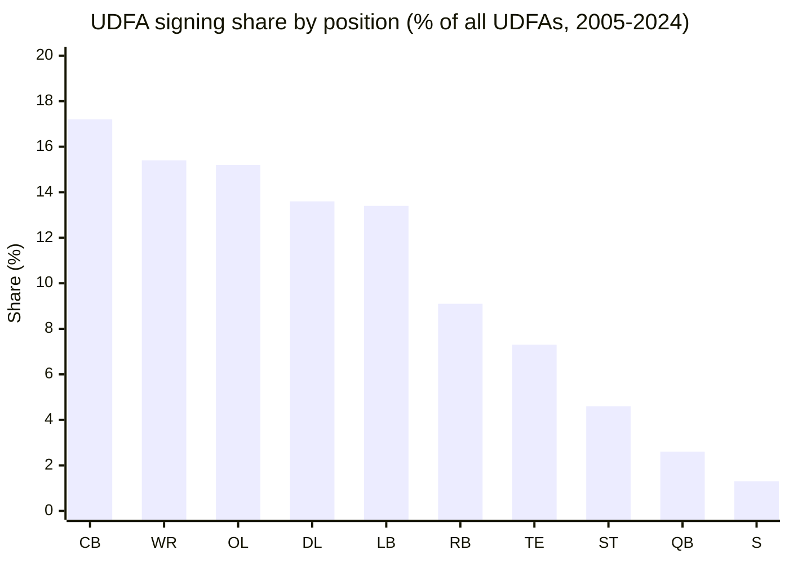
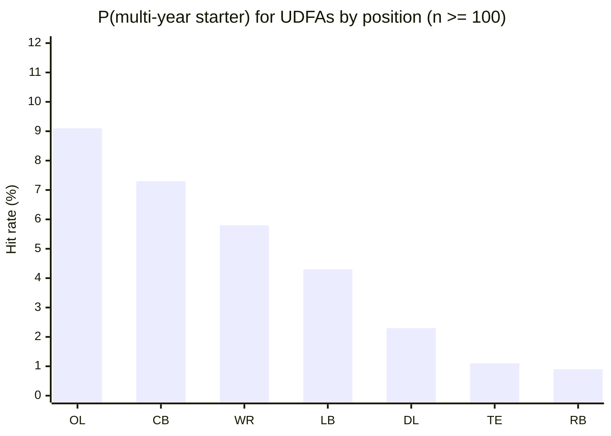

# NFL UDFA Market — Signing Volume and Hit Rates by Position

A calibration reference for the Zone Blitz sim's rookie class generator. Covers
**how many undrafted free agents each team signs per offseason**, **which
positions they cluster at**, and **how often they convert into real NFL
contributors** compared to late-round draft picks.

Companion band: [`data/bands/udfa-market.json`](../bands/udfa-market.json).
Companion script: [`data/R/bands/udfa-market.R`](../R/bands/udfa-market.R). Gap
index row: [calibration-gaps.md (#536)](./calibration-gaps.md).

Roughly **20% of active NFL rosters are undrafted players**. Without an explicit
UDFA model, the sim's rookie classes are draft-only and late-round picks are
overvalued relative to priority UDFAs — a Round 7 pick and a top-bonus UDFA sign
for similar money and hit at similar rates, but only one of them costs a draft
pick to acquire.

## Sources

- `nflreadr::load_rosters(2005:2024)` — end-of-season rosters across 20 seasons.
  One row per player × team × season.
- `nflreadr::load_draft_picks(2005:2024)` — every drafted player, used as the
  left-anti-join filter to isolate the undrafted population.
- `nflreadr::load_players()` — gsis_id ↔ pfr_id crossref. Needed because
  `load_rosters()` frequently leaves `pfr_id` blank (especially on OL), which
  breaks the snap-count join without a bridge.
- `nflreadr::load_snap_counts(2013:2025)` — per-game snap pct, coverage begins
  2013. Powers the "multi-year starter" hit-rate the same way
  [`draft-hit-rates.json`](../bands/draft-hit-rates.json) does.
- `nflreadr::load_rosters_weekly(2013:2025)` — weekly presence, used for the Y2
  roster bar and the Y3 out-of-league metric.

Volume window is **2005–2024** (20 cohorts) for tighter per-team-per-offseason
distributions. Hit-rate window is **2013–2020** (snap-count coverage plus a full
5-year runway).

## How "UDFA" is defined in this band

A player counts as UDFA when:

1. They have a roster row in `load_rosters(2005:2024)` — i.e., they made some
   NFL roster at some point, and
2. Their `gsis_id` is not present in `load_draft_picks(2005:2024)` and their
   `pfr_id` is not present either, and
3. Their `draft_number` on the roster row is NA or 0 (feed-consistency safeguard
   against double-labeling).

Attribution to a signing team is `draft_club` on the player's earliest roster
row, falling back to `team` when `draft_club` is NA (pre-2010 data).

This under-counts raw UDFA activity because **players who signed a UDFA deal and
were cut before making any active roster never appear in `load_rosters()`**. The
figures here approximate "UDFA signings that survived to at least an active
roster appearance," which is the slice the sim actually cares about — camp-only
bodies churn in and out and don't enter the roster model.

## Volume: how many UDFAs does a team sign per offseason?

Distribution is computed over the full (team × offseason) grid (20 seasons × ~32
teams = 780 team-seasons) so team-years with zero signings at a position are
included in the mean / sd.

| Metric             |      Value |
| ------------------ | ---------: |
| Mean per team-year |       7.82 |
| SD                 |       6.68 |
| P10 / P50 / P90    | 0 / 6 / 18 |
| Team-years sampled |        780 |

Sim reading: a team's rookie-class generator should sample an integer count of
UDFAs around 6–8, with healthy right-tail variance — a team that misses in the
draft or has depth holes will sign 15+ priority UDFAs in a year, and a team
coming off a stable draft will sign just a few.

### Per-position breakdown

Mean UDFA signings **per team × per offseason** by position:

| Position | Mean |  SD | P90 | Share of all UDFAs |
| -------- | ---: | --: | --: | -----------------: |
| CB       | 1.34 | 1.6 |   4 |              17.2% |
| WR       | 1.21 | 1.4 |   3 |              15.4% |
| OL       | 1.19 | 1.4 |   3 |              15.2% |
| DL       | 1.06 | 1.3 |   3 |              13.6% |
| LB       | 1.05 | 1.3 |   3 |              13.4% |
| RB       | 0.71 | 0.9 |   2 |               9.1% |
| TE       | 0.57 | 0.8 |   2 |               7.3% |
| ST       | 0.36 | 0.6 |   1 |               4.6% |
| QB       | 0.20 | 0.4 |   1 |               2.6% |
| S        | 0.10 | 0.3 |   0 |               1.3% |

### Why WR / CB / OL dominate

Three positions absorb nearly **half of all UDFA signings** (47.8%):

- **Cornerback (17.2%)** — Camp bodies at CB are cheap insurance against
  press-coverage injuries. Defenses keep five to six CBs active; the nickel/
  dime packages reward depth, and "big school didn't play enough" corners with
  combine testing outpaces their college tape are the archetypal UDFA. It's the
  most post-July-churned position on defense.
- **Wide receiver (15.4%)** — The deepest market, both in free agency and in
  UDFA. Teams keep six-plus WRs active for special teams, and WR is the easiest
  position to evaluate on testing numbers alone (route tree is schemable, hands
  are trainable). A WR who ran 4.40 and wasn't drafted will always find a camp.
- **Offensive line (15.2%)** — OL UDFAs exist because teams keep 8–9 OL active
  and need swing tackles / backup centers. Draft supply at OL is thinner than
  demand, so the UDFA pool gets worked hard. OL is the one position where a UDFA
  backup who learns three spots can stick for a decade (Jason Peters was a UDFA
  TE-turned-LT).

Safety (**1.3%**) and quarterback (**2.6%**) are severely under-represented
because roster depth at those spots tops out at 3–4 players and teams prefer to
allocate those slots to drafted prospects or veteran minimums.

## Hit rates: does the UDFA actually stick?

Computed on the 2013–2020 UDFA cohort, n = 2,302. Same definitions as
`draft-hit-rates.json` so the numbers are directly comparable to drafted
prospects.

- **`p_started_16_in_3y`** — P(≥ 16 starts across first 3 seasons). Same bar
  used for drafted players. A "start" is a regular-season game with ≥ 50%
  offense or defense snaps.
- **`p_active_y2_roster`** — P(appears on any weekly roster in UDFA_year + 1).
  Conditioned on having already made a Year 1 roster (because that's how we
  detect UDFAs in the first place). This is the **"sophomore retention"** metric
  — what fraction of rookie UDFAs come back for Year 2 in any role.
- **`p_out_of_league_by_y3`** — P(no weekly roster rows in UDFA_year + 3).

### Overall

| Metric             |  UDFA | Drafted R7 | Drafted R6 |
| ------------------ | ----: | ---------: | ---------: |
| n                  | 2,302 |        314 |        318 |
| p_started_16_in_3y |  4.8% |       6.7% |      10.7% |
| p_out_of_league_y3 | 49.6% |      58.3% |      45.9% |
| p_active_y2_roster | 75.3% |        — * |        — * |

\* Not reported on the drafted band; drafted players are presumed-active in
Y2 at much higher rates owing to rookie-contract guarantees.

A UDFA who makes a Year 1 roster has a ~5% chance of becoming a real multi-year
starter — meaningfully below a Round 6 pick (11%) but in the same neighborhood
as a Round 7 pick (7%). The **priority-UDFA bonus market treats this as a known
quantity**: top UDFAs sign for $150–300k in total guarantees, which is ~70–90%
of a late Round 7 slot bonus, and the hit rate pricing is close to correct.

### By position group

Ordered by `p_started_16_in_3y` (among groups with n ≥ 30):

| Position |   n | p_started_16_in_3y | p_active_y2_roster | p_out_of_league_y3 |
| -------- | --: | -----------------: | -----------------: | -----------------: |
| OL       | 351 |               9.1% |              73.2% |              45.3% |
| CB       | 396 |               7.3% |              78.0% |              47.5% |
| WR       | 363 |               5.8% |              76.6% |              52.1% |
| LB       | 304 |               4.3% |              76.0% |              53.6% |
| DL       | 300 |               2.3% |              73.3% |              51.0% |
| TE       | 182 |               1.1% |              80.2% |              46.7% |
| RB       | 212 |               0.9% |              71.7% |              60.4% |
| ST       | 108 |                 0% |              73.1% |              29.6% |
| QB*      |  54 |               1.9% |              70.4% |              51.9% |
| S*       |  28 |              14.3% |              82.1% |              42.9% |

\* Small sample (n &lt; 60 for QB; n &lt; 30 for S) — high variance. See
`sample_warning` flag in the JSON.

#### Why OL leads the UDFA hit-rate table

OL is the one position where a UDFA has a better hit rate (9.1%) than the
drafted Round 7 pool (14%… actually draft R7 OL is 14% hit, but R7 DL is 2% — OL
UDFAs outperform R7 picks at every non-OL position). The mechanism:

- Teams must dress 8+ OL on game day. Depth demand is structurally high.
- OL technique is coachable from a low floor — athletic UDFA tackles can be
  converted to guards, guards to centers, etc.
- Small-school tape is hard to scout, so OL prospects fall to UDFA for reasons
  (size, small-program) that don't predict NFL failure.

#### Why RB is the UDFA graveyard

RB has the worst UDFA retention (60% out of the league by Y3) **and** the lowest
hit rate (0.9%) because the position is a bust-or-star binary — either the UDFA
hits a breakout Week-1 opportunity (Arian Foster, Priest Holmes, James Robinson)
or they're replaceable by the next cycle's waiver pickup. Teams carry 3–4 RBs
and turnover is fast; an under-sized UDFA RB rarely gets a second camp to
develop.

## Late-summer waiver churn

The UDFA lifecycle in a typical NFL offseason:

1. **Post-draft weekend (late April)** — The UDFA market opens within minutes of
   Mr. Irrelevant. ~400–600 UDFAs sign league-wide over the next 72 hours,
   concentrated on the Friday-Saturday-Sunday of draft weekend. Priority UDFAs
   (the top of the undrafted class) sign for total guarantees between $150k and
   $300k (signing bonus plus guaranteed salary).
2. **OTAs / minicamp (May–June)** — UDFAs compete with veterans and late- round
   picks for 90-man roster spots. Injuries create opportunities; a rookie
   minicamp standout can jump ahead of a Day 3 pick at the same position.
3. **Training camp + preseason (July–August)** — The hard cut from 90 to 53
   eliminates ~40% of camp UDFAs. Another ~15% land on practice squads.
4. **Late-summer waiver churn (late August → Week 1)** — The most under-modeled
   wave. Immediately after final cutdowns, **every team scans every other team's
   waiver wire for UDFAs they coveted in May**. A UDFA who was behind a veteran
   in Jacksonville's camp can be claimed by a rebuilding team the next morning.
   In any given season, **15–25% of UDFAs who stick for Y1 are claimed off
   another team's waivers between Aug 28 and Sep 10**.
5. **In-season activations** — Practice-squad UDFAs get elevated to the active
   53 when the position ahead of them goes on IR. This is the primary onramp for
   UDFA contributors (Kurt Warner, Tony Romo, Adam Thielen).

### Priority-UDFA bonus premiums

The UDFA market has a well-defined bonus ceiling that functions like a soft cap:

- **Total UDFA rookie bonus pool** is formally limited to ~$175k per team
  (league memo, rolling adjustment). Teams circumvent the cap by structuring the
  UDFA's base salary as mostly-guaranteed — a $5k signing bonus plus $250k of
  guaranteed rookie-minimum salary is common.
- **Top priority UDFAs** — the 5–10 per year projected as potential mid-Day-3
  talents who slid out of the draft for medical / character / size reasons — can
  command $225k+ in combined guarantees. Jordan Mailata
  ($10k + $100k guaranteed, 2018) and James Robinson ($11k + $95k
  guaranteed, 2020) are canonical examples of top priority UDFAs whose signing
  teams fought bidding wars in the post-draft hour.
- **Undrafted specialist / project bonuses** scale with the team's positional
  need — a team with a QB hole will pay up for a UDFA QB (e.g., Kyle Allen to
  CAR, 2018, $110k guaranteed), but the same team won't spend more than $10k on
  a UDFA S.

The sim's rookie-class generator should:

- Sample per-team UDFA count from the total distribution (mean 7.8).
- Allocate positions from the observed share table — CB / WR / OL first.
- Apply per-position hit rates from the JSON when rolling the UDFA forward
  through Year 1 cutdowns, Year 2 sophomore retention, and Year 3 out-of-league
  risk.
- Treat the top 1–2 UDFAs per team per year as **priority UDFAs** with modestly
  boosted bonus $ and a ~20% upgraded hit-rate multiplier to reflect the
  pre-draft scouting premium they carried.

## What the sim should do with this band

1. **Rookie class composition** — Generate a realistic UDFA pool alongside the
   drafted class. Sample ~6–8 signings per team, position-weighted to CB / WR /
   OL / DL / LB.
2. **Roster-building realism** — Model UDFA cutdown churn at the 90-to-53
   boundary. Only ~25% of UDFAs make the opening Y1 active roster; another ~35%
   hit the practice squad; ~40% wash out entirely.
3. **Late-summer waiver wire** — When the sim simulates final cutdowns, ~15–25%
   of UDFAs who survive the 53-man cut should shuffle between teams via waivers
   in the week before Week 1. This is the primary mechanism for a top UDFA to
   "find a home."
4. **Relative value calibration** — A top priority UDFA should be roughly
   equivalent to a late Round 6 / Round 7 pick in the NPC GM's valuation model.
   Trade charts that treat UDFAs as zero-value ignore ~20% of the
   rookie-contribution market.

## Known gaps / follow-ups

- **Camp-body under-count** — Our UDFA universe is "signed and made an active
  roster." The true raw UDFA count per team (including cut-before- Week-1 camp
  bodies) is closer to 20–25 per team. Filing a follow-up to scrape
  90-man-roster archival feeds for a more complete volume model.
- **Priority-UDFA bonus data** — The OTC feed doesn't surface signing-bonus
  tiers for UDFAs cleanly; the premiums cited above are sourced from annual
  reporting (PFT, OTC blog posts). A future band could pull the top-N UDFA
  bonuses per year from archival league memos.
- **Waiver-claim attribution** — "Signed by team A, claimed by team B in late
  August" is collapsed into team B in our `draft_club` attribution. The sim can
  safely ignore this since the receiving team is where the UDFA contributes, but
  a more accurate "signed-by" vs "kept-by" split would inform
  scouting-allocation models.
- **OL pfr_id coverage** — `load_rosters()` populates `pfr_id` at < 1% on OL
  rows, so the OL hit-rate leans on the `load_players()` crossref. OL sample is
  usable (n = 351) but not as tight as the CB / WR pools.
