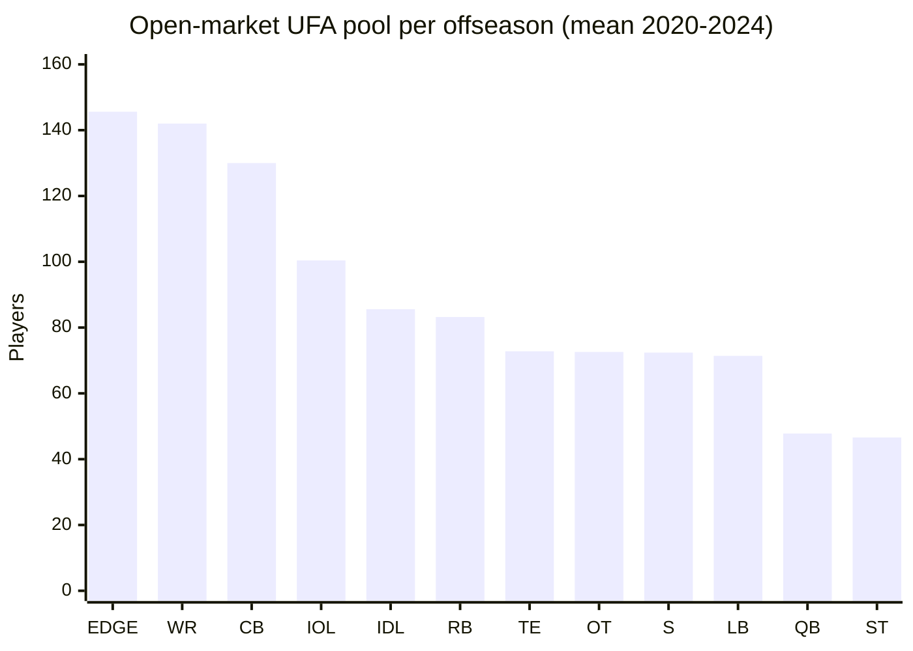
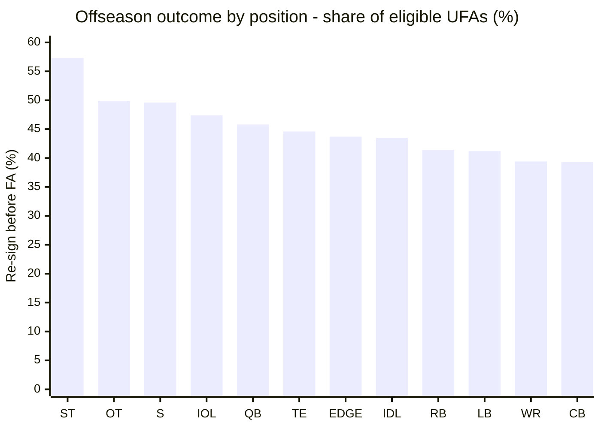

# UFA Pool Composition & Re-sign Rate Gating

How many **distinct veterans** hit free agency at each position each offseason,
and what share of them re-sign with their own team **before** the market opens
vs. sign elsewhere vs. fall out of the league entirely. Pairs with
[`free-agent-market.md`](./free-agent-market.md) — the market doc answers "what
do FA contracts look like once signed"; this doc answers "who is in the pool in
the first place, and does the market ever get to bid on them".

Companion band:
[`data/bands/ufa-pool-composition.json`](../bands/ufa-pool-composition.json).
Companion script:
[`data/R/bands/ufa-pool-composition.R`](../R/bands/ufa-pool-composition.R).

## Why a separate band

`free-agent-market.json` counts **contract rows** where `team != draft_team` as
"external UFA signings". That heuristic is fine for AAV-tier shape, but it
over-samples the pool: every minimum-salary depth signing, practice-squad
elevation, futures contract, ERFA tender, and cut-day re-signing is a row, and a
single player can generate 3-4 rows a season as they get cycled through practice
squads. A raw count of ~425 "WR external signings per offseason" is not the same
thing as 425 WRs hitting the open market — it's closer to 80-90 distinct WRs
plus a lot of roster churn.

The sim's FA generator needs the **pool size per position**, not the churn
count. Sampling a WR from a 425-sized pool produces implausible depth charts;
sampling from a ~140-sized pool produces realistic ones.

## Method

1. **Roster membership** — `nflreadr::load_rosters(2019:2024)` gives one row per
   player-season-team (we keep the last-week roster so cut-day moves settle).
2. **Eligibility** — a player on a season-N roster with `years_exp >= 2`
   (entering season N+1 with 3+ accrued seasons; RFA/UFA eligible) is a
   _potential UFA_ going into offseason N+1.
3. **Outcome classification** — compare `team_N` to `team_(N+1)`:
   - `re_sign_before_fa` — same team in N+1. Captures extensions, re-ups, and
     franchise/transition tags that keep the player off the open market.
   - `signed_elsewhere` — different team in N+1. Hit the market and moved.
   - `out_of_league` — no roster appearance in N+1. Retired, cut without
     signing, career-ending injury, or washed out of the league.
4. **Tier enrichment** — join `nflreadr::load_contracts()` on
   `(gsis_id, year_signed == offseason)` so each transition can be placed in an
   APY tier (`top_10 / top_25 / top_50 / rest`). Players without a signed
   contract (min-deal UDFAs, practice-squad, out-of-league) fall into `rest`.

## UFA pool composition by position

Means across offseasons 2020–2024 (transitions resolved 2019-2024):

| Position | Eligible UFAs | Re-sign before FA | Signed elsewhere | Out of league | Open-market pool | Share of open market |
| -------- | ------------: | ----------------: | ---------------: | ------------: | ---------------: | -------------------: |
| EDGE     |         258.8 |             113.2 |             89.2 |          56.4 |            145.6 |                13.6% |
| WR       |         234.4 |              92.4 |             86.6 |          55.4 |            142.0 |                13.3% |
| CB       |         214.2 |              84.2 |             77.8 |          52.2 |            130.0 |                12.1% |
| IOL      |         191.0 |              90.6 |             60.0 |          40.4 |            100.4 |                 9.4% |
| IDL      |         151.6 |              66.0 |             57.8 |          27.8 |             85.6 |                 8.0% |
| RB       |         142.0 |              58.8 |             46.6 |          36.6 |             83.2 |                 7.8% |
| TE       |         131.4 |              58.6 |             41.4 |          31.4 |             72.8 |                 6.8% |
| OT       |         144.8 |              72.2 |             44.6 |          28.0 |             72.6 |                 6.8% |
| S        |         143.6 |              71.2 |             43.0 |          29.4 |             72.4 |                 6.8% |
| LB       |         121.4 |              50.0 |             45.2 |          26.2 |             71.4 |                 6.7% |
| QB       |          88.2 |              40.4 |             33.8 |          14.0 |             47.8 |                 4.5% |
| ST       |         109.2 |              62.6 |             28.0 |          18.6 |             46.6 |                 4.4% |

**Open-market pool** = `signed_elsewhere + out_of_league` — the set of players
who _could_ sign with any team once the league year opens. This is the
sample-space the sim's FA generator should draw from, weighted by
`open_market_pool_share`.



### Sim implication — replace the uniform 50

Today `server/features/players/players-generator.ts` generates a uniform 50-
player pool round-robined across 15 buckets (~3.3 FAs per position). The table
above shows the real shape is anything but uniform:

- EDGE and WR each contribute ~13% of the open market (~140 each).
- QB and ST each contribute ~4.5% (~47 each — and QB skews almost entirely
  toward backup depth, not starters).
- A sim FA generator sized to ~500 open-market slots should allocate roughly:
  EDGE 68, WR 66, CB 60, IOL 47, IDL 40, RB 39, TE/OT/S/LB 33-34, QB/ST 22-22.

Scaled down to the sim's current ~50-player pool, that's roughly:

| Position      | Pool allocation (of ~50) |
| ------------- | -----------------------: |
| EDGE          |                        7 |
| WR            |                        7 |
| CB            |                        6 |
| IOL           |                        5 |
| IDL, RB       |                     4, 4 |
| TE, OT, S, LB |                 3-4 each |
| QB, ST        |                     2, 2 |

Compared to the current uniform 3.3 per bucket: WR/EDGE/CB are under-represented
by ~2× and QB/ST are over-represented by ~1.5×.

## Re-sign rate gating (own-team retention before FA)

Share of eligible UFAs per position that **never hit the market** because the
drafting team re-signs/extends/tags them:

| Position | Re-sign before FA | Signed elsewhere | Out of league |
| -------- | ----------------: | ---------------: | ------------: |
| ST       |             57.3% |            25.6% |         17.0% |
| OT       |             49.9% |            30.8% |         19.3% |
| S        |             49.6% |            29.9% |         20.5% |
| IOL      |             47.4% |            31.4% |         21.2% |
| QB       |             45.8% |            38.3% |         15.9% |
| TE       |             44.6% |            31.5% |         23.9% |
| EDGE     |             43.7% |            34.5% |         21.8% |
| IDL      |             43.5% |            38.1% |         18.3% |
| RB       |             41.4% |            32.8% |         25.8% |
| LB       |             41.2% |            37.2% |         21.6% |
| WR       |             39.4% |            36.9% |         23.6% |
| CB       |             39.3% |            36.3% |         24.4% |



**Why these numbers differ from `free-agent-market.md`:**

The sibling doc reports re-sign rates of 9-23% based on contract rows; this doc
reports 39-57% based on roster transitions. Both are "correct" for their
denominator:

- Contract-row denominator — includes cut-day minimums, practice-squad, and
  futures deals where the "team" field flips constantly. Depresses the rate.
- Roster-transition denominator — one observation per eligible player per
  offseason. Matches PFF's ~35-45% headline number for "veteran UFAs who re-sign
  with their own team on first trip".

**The sim should use this doc's rates for the re-sign _gate_** (does this player
hit the market?) and `free-agent-market.md`'s tiered AAV bands for contract
economics (once they do hit the market, what do they sign for).

### Position narratives

- **Specialists (ST)** have the highest re-sign rate (57%) — K/P/LS churn on
  1-year deals but churn _with their current team_ most often. Cheap to re-sign,
  and teams rarely chase specialists on the market.
- **OL (OT/IOL)** retain at 47-50% — continuity matters and teams bet on aging
  curves; OL is also hardest to scout externally, so incumbents have a built-in
  advantage.
- **QB retention of 46% is skewed** by the "backup 1-year extension" pattern.
  Starting QBs almost never hit free agency (tag or extension); the QB column
  here is dominated by QB2/QB3 retention.
- **WR and CB are the mobility leaders** (39% re-sign, ~37% signed elsewhere) —
  these are the two positions where the open market actually gets the most shots
  on high-end talent.
- **RB has the highest attrition** (26% out-of-league) — brutal aging curve +
  replaceable-at-minimum market. Matches the post-Barkley narrative.

## Re-sign rate by tier

The re-sign rate for the top of each position's market is meaningfully higher
than for replacement-level players. Top-10-APY-tier retention runs 80-100%
across positions (franchise tag + extend-before-FA is the dominant path for the
elite); `rest`-tier retention sits at 31-50%.

```mermaid
xychart-beta
    title "Re-sign rate by tier - QB / WR / EDGE / CB (%)"
    x-axis ["QB", "WR", "EDGE", "CB"]
    y-axis "Re-sign rate (%)" 0 --> 100
    bar [100, 80, 58.3, 80]
    bar [68.8, 73.3, 60, 53.3]
    bar [50, 79.2, 54.5, 40]
    bar [36.5, 34.9, 37.7, 35.2]
```



Legend: top_10 / top_25 / top_50 / rest bars, left-to-right per position.

| Position | top_10 | top_25 | top_50 | rest |
| -------- | -----: | -----: | -----: | ---: |
| QB       |  100.0 |   68.8 |   50.0 | 36.5 |
| WR       |   80.0 |   73.3 |   79.2 | 34.9 |
| TE       |  100.0 |   78.6 |   37.5 | 38.7 |
| OT       |  100.0 |   86.7 |   70.4 | 41.7 |
| IOL      |   90.0 |   66.7 |   43.5 | 41.8 |
| EDGE     |   58.3 |   60.0 |   54.5 | 37.7 |
| IDL      |  100.0 |   90.9 |   60.9 | 33.8 |
| LB       |   66.7 |   33.3 |   47.4 | 31.5 |
| CB       |   80.0 |   53.3 |   40.0 | 35.2 |
| S        |   80.0 |   80.0 |   54.2 | 42.7 |
| RB       |   90.0 |   80.0 |   54.2 | 34.6 |
| ST       |   88.9 |   93.3 |   70.8 | 40.5 |

Top-10 sample sizes are small (9-12 per position across 5 offseasons) so
individual numbers jitter; treat the **shape** (top_10 >> top_25 >~ top_50 >>
rest) as the prior, not the exact percentage.

## How the sim should use this band

1. **Size the FA pool per position** — multiply a target pool size (e.g. 50) by
   `pool_composition_by_position[*].open_market_pool_share`. The result is the
   number of UFAs to generate per position, replacing the uniform round-robin.

2. **Apply the re-sign gate per eligible veteran** — for each drafted /
   previously-signed player nearing contract expiry:

   ```
   tier = tier_of(player)  // from their current contract's APY
   P_resign = resign_rate_by_position_tier[pos][tier]
   if random() < P_resign:
     player stays on own team with an extension at tier mean_apy
   else:
     player enters the open-market FA pool
   ```

   This is the core mechanic the issue proposal calls for.

3. **Attrition for out-of-league** — apply
   `signed_elsewhere_rate + out_of_league_rate` together as "hits the market",
   then within "hits the market" use `out_of_league_rate / (out_of_league_rate
   - signed_elsewhere_rate)` as the probability of NOT getting a deal this cycle
     (effective retirement / career-ending).

4. **Contract economics, once signed** — delegate to
   [`free-agent-market.md`](./free-agent-market.md) tier bands. This band
   answers "does the player hit the market"; that band answers "what does the
   contract look like".

## Known gaps / follow-ups

- `years_exp >= 2` is a proxy for "UFA-eligible under the CBA's 4-accrued-
  seasons rule". Exact accrued-seasons data is not in the rosters feed.
  RFA-eligible players (3 accrued) are blended in, which slightly inflates the
  re-sign rate for the lower tiers (RFA tenders count as re-signs).
- Franchise / transition tags are not flagged in either feed — they appear as
  `re_sign_before_fa` with a 1-year contract in the contracts feed.
- `out_of_league` mixes retirees, cuts, and injured-reserve-then-released
  outcomes. Sim-side we should split these: retirement rate vs. genuine
  "undrafted by the market" attrition.
